# Class 07
Aarav Prasad

- [Background](#background)
- [k-means clustering](#k-means-clustering)
- [Hierarchical Clustering](#hierarchical-clustering)
- [Principal Component Analysis
  (PCA)](#principal-component-analysis-pca)
- [Analysis of UK food data](#analysis-of-uk-food-data)
- [Data Import](#data-import)
- [Tidy data](#tidy-data)
- [Exploratory analysis](#exploratory-analysis)
- [PCA to the rescue](#pca-to-the-rescue)

## Background

We will be looking at different ways to cluster data.

## k-means clustering

We will use `kmeans()` for k-means clustering, the base r function for
this. We will first use some easy sample data, using `rnorm()`.

``` r
hist(rnorm(1000, mean=3))
```

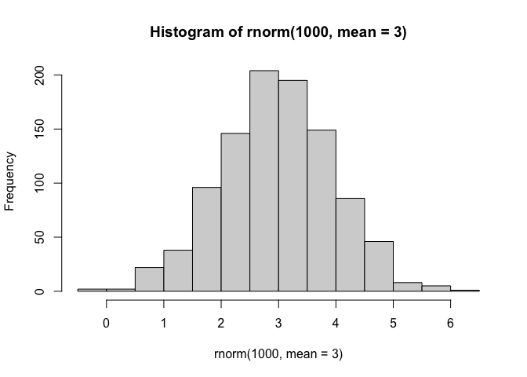

``` r
x <- c(rnorm(30, mean = -3), rnorm(30, mean = 3))
x
```

     [1] -2.4856239 -3.4531774 -1.5219136 -2.3316535 -3.5926049 -3.7096497
     [7] -2.4437048 -2.4274215 -2.7560929 -3.6256137 -4.7370345 -4.0252377
    [13] -5.1180305 -3.0756634 -2.1625973 -3.5096289 -2.7177198 -3.4934278
    [19] -4.1470996 -1.8037927 -3.3540461 -3.4939296 -1.6147229 -2.8062234
    [25] -3.5256716 -2.5189167 -3.9731424 -5.6554176 -2.0104294 -3.1368214
    [31]  2.3680751  1.5672123  3.2549990  2.7142944  2.1238243  3.7992050
    [37]  3.5973537  3.7109614  3.7334649  4.1980619  3.2008244  4.7661457
    [43]  1.9860224  2.3323428  3.4243537  1.3993418  4.5298134  0.8144676
    [49]  3.1459434  3.4672577  4.7096516  2.2151751  3.7323788  2.1860614
    [55]  3.3882145  3.3895904  3.2172400  2.9444969  0.5503201  2.4185183

``` r
z <- cbind(x = x, y = rev(x))
```

Now we can run `kmeans()` on this imput `z` and see what the results
look like.

``` r
km <- kmeans(z, centers = 2)
km
```

    K-means clustering with 2 clusters of sizes 30, 30

    Cluster means:
              x         y
    1  2.962854 -3.174234
    2 -3.174234  2.962854

    Clustering vector:
     [1] 2 2 2 2 2 2 2 2 2 2 2 2 2 2 2 2 2 2 2 2 2 2 2 2 2 2 2 2 2 2 1 1 1 1 1 1 1 1
    [39] 1 1 1 1 1 1 1 1 1 1 1 1 1 1 1 1 1 1 1 1 1 1

    Within cluster sum of squares by cluster:
    [1] 61.51579 61.51579
     (between_SS / total_SS =  90.2 %)

    Available components:

    [1] "cluster"      "centers"      "totss"        "withinss"     "tot.withinss"
    [6] "betweenss"    "size"         "iter"         "ifault"      

``` r
attributes(km)
```

    $names
    [1] "cluster"      "centers"      "totss"        "withinss"     "tot.withinss"
    [6] "betweenss"    "size"         "iter"         "ifault"      

    $class
    [1] "kmeans"

> Q. How many points are in each cluster?

``` r
km$size
```

    [1] 30 30

> Q. What component of your result object details cluster
> assignment/membership?

``` r
km$cluster
```

     [1] 2 2 2 2 2 2 2 2 2 2 2 2 2 2 2 2 2 2 2 2 2 2 2 2 2 2 2 2 2 2 1 1 1 1 1 1 1 1
    [39] 1 1 1 1 1 1 1 1 1 1 1 1 1 1 1 1 1 1 1 1 1 1

> Q. What component of your result object details cluster center?

``` r
km$centers
```

              x         y
    1  2.962854 -3.174234
    2 -3.174234  2.962854

> Q. Plot `z` colored by the kmeans cluster assignment and add cluster
> centers as blue points

``` r
plot(z, col = c("red", "blue"))
```

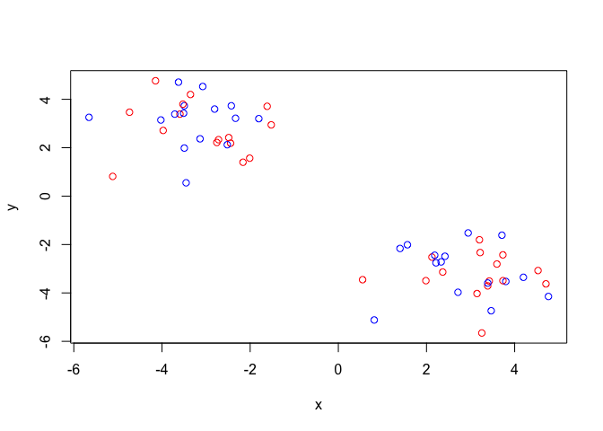

``` r
plot(z, col = km$cluster)
points(km$centers, col = "blue", pch = 15)
```

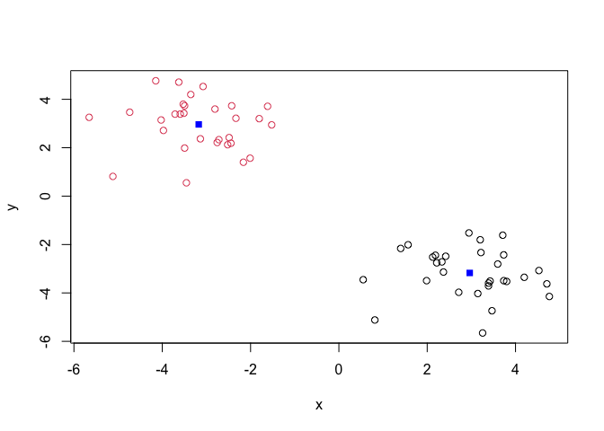

> Q. Run a k-means clustering and plot the results asking for 4
> clusters?

``` r
km4 <- kmeans(z, centers = 4)
plot(z, col = km4$cluster)
points(km4$centers, col = "black" , pch =15, cex = 2)
```

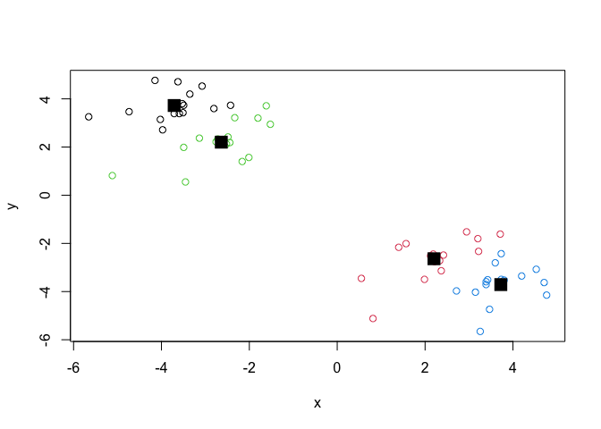

> **Note** You need to tell k-means the number of clusters (i.e. set
> `centers=2`)!!

One approach is to try different values for `centers` and then pick the
best…

``` r
ans <- NULL
for(i in 1:10){
  km <- kmeans(z, centers=i)
  ans <- c(ans, km$tot.withinss)
}

plot(ans, typ = "o", xlab = "Number of clusters", ylab= "Total Sum of Squares Distance")
```

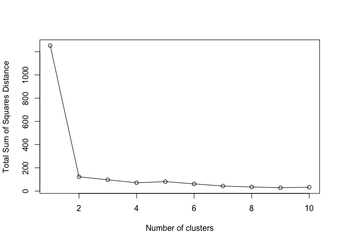

## Hierarchical Clustering

The main function in “base” R for Hierarchical clustering is called
`hclust()`

This function does not take your “raw” data for clustering. You must
first build a “distance matrix” from your data and pass this as input to
`hclust()`

``` r
d <- dist(z)
hc <- hclust(d)
hc
```


    Call:
    hclust(d = d)

    Cluster method   : complete 
    Distance         : euclidean 
    Number of objects: 60 

There is a bespoke `plot()` method for `hclust()` result objects.

``` r
plot(hc)
abline(h=8, col ="red")
```

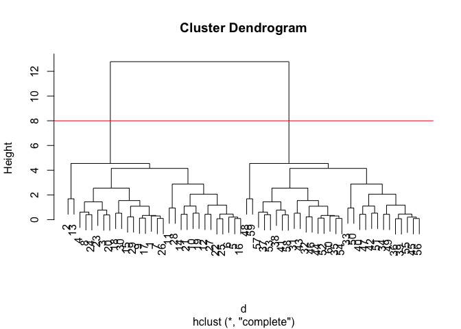

Once we have our `hclust` object (our “tree” of “cluster dendrogram”) we
can *“cut”* the tree to reveal the clustering pattern.

``` r
cutree(hc, h=8)
```

     [1] 1 1 1 1 1 1 1 1 1 1 1 1 1 1 1 1 1 1 1 1 1 1 1 1 1 1 1 1 1 1 2 2 2 2 2 2 2 2
    [39] 2 2 2 2 2 2 2 2 2 2 2 2 2 2 2 2 2 2 2 2 2 2

``` r
cutree(hc, k=4)
```

     [1] 1 2 1 1 1 1 1 1 1 1 1 1 2 1 1 1 1 1 1 1 1 1 1 1 1 1 1 1 1 1 3 3 3 3 3 3 3 3
    [39] 3 3 3 3 3 3 3 3 3 4 3 3 3 3 3 3 3 3 3 3 4 3

> Q. Make a plot of `z` with your hclust results (i.e. colored by
> cluster membership)

``` r
grps <-cutree(hc, k =2)
plot(z, col = grps)
```

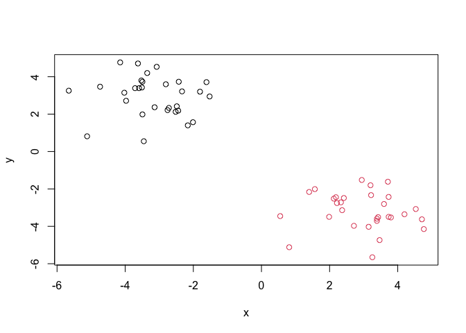

## Principal Component Analysis (PCA)

PCA is a dimensionality reduction method that is popular for revealing
patterns in complex datasets

## Analysis of UK food data

Let’s look at some data on the eating habits of folks from the UK to see
if there are patterns and trends that have some regions being distinct
from others.

## Data Import

The data is made available in CSV format so we can use the `read.csv()`
function for import to R:

``` r
url <- "https://tinyurl.com/UK-foods"
x <- read.csv(url)
```

> Q1: How many rows and columns are in your new data frame named x? What
> R functions could you use to answer this questions?

There are 17 rows and 5 columns. `dim(x)`, `ncol(x)`, and `nrow(x)` can
be used

``` r
dim(x)
```

    [1] 17  5

``` r
head(x)
```

                   X England Wales Scotland N.Ireland
    1         Cheese     105   103      103        66
    2  Carcass_meat      245   227      242       267
    3    Other_meat      685   803      750       586
    4           Fish     147   160      122        93
    5 Fats_and_oils      193   235      184       209
    6         Sugars     156   175      147       139

## Tidy data

``` r
rownames(x) <- x[,1]
x <- x[,-1]
head(x)
```

                   England Wales Scotland N.Ireland
    Cheese             105   103      103        66
    Carcass_meat       245   227      242       267
    Other_meat         685   803      750       586
    Fish               147   160      122        93
    Fats_and_oils      193   235      184       209
    Sugars             156   175      147       139

``` r
dim(x)
```

    [1] 17  4

``` r
x <- read.csv(url, row.names=1)
head(x)
```

                   England Wales Scotland N.Ireland
    Cheese             105   103      103        66
    Carcass_meat       245   227      242       267
    Other_meat         685   803      750       586
    Fish               147   160      122        93
    Fats_and_oils      193   235      184       209
    Sugars             156   175      147       139

> Q2. Which approach to solving the ‘row-names problem’ mentioned above
> do you prefer and why? Is one approach more robust than another under
> certain circumstances?

I prefer row.names = 1 because it’s cleaner and fixes the issue
immediately. The manual method is better if the data is already loaded
or needs inspection, but it is destructive and keeps removing columns.

## Exploratory analysis

Spotting major differences or threads

``` r
# Using base R
barplot(as.matrix(x), beside = T, col=rainbow(nrow(x)))
```


> Q3: Changing what optional argument in the above barplot() function
> results in the following plot?

Setting beside to false (or leaving it out),

``` r
barplot(as.matrix(x), beside=F, col=rainbow(nrow(x)))
```


``` r
library(tidyr)

# Convert data to long format for ggplot with `pivot_longer()`
x_long <- x |> 
          tibble::rownames_to_column("Food") |> 
          pivot_longer(cols = -Food, 
                       names_to = "Country", 
                       values_to = "Consumption")

dim(x_long)
```

    [1] 68  3

``` r
head(x_long)
```

    # A tibble: 6 × 3
      Food            Country   Consumption
      <chr>           <chr>           <int>
    1 "Cheese"        England           105
    2 "Cheese"        Wales             103
    3 "Cheese"        Scotland          103
    4 "Cheese"        N.Ireland          66
    5 "Carcass_meat " England           245
    6 "Carcass_meat " Wales             227

``` r
library(ggplot2)
ggplot(x_long) +
  aes(x = Country, y = Consumption, fill = Food) +
  geom_col(position = "dodge") +
  theme_bw()
```


> Q4: Changing what optional argument in the above ggplot() code results
> in a stacked barplot figure?

Removing the `geom_col` argument position=“dodge” creates the stacked
barplot figure.

``` r
ggplot(x_long) +
  aes(x = Country, y = Consumption, fill = Food) +
  geom_col() +
  theme_bw()
```


> Q5: We can use the pairs() function to generate all pairwise plots for
> our countries. Can you make sense of the following code and resulting
> figure? What does it mean if a given point lies on the diagonal for a
> given plot?

If a point lies on the diagonal for a plot that means the countries have
equal values for that food.

``` r
pairs(x, col=rainbow(nrow(x)), pch=16)
```


``` r
library(pheatmap)

pheatmap( as.matrix(x) )
```


> Q6. Based on the pairs and heatmap figures, which countries cluster
> together and what does this suggest about their food consumption
> patterns? Can you easily tell what the main differences between N.
> Ireland and the other countries of the UK in terms of this data-set?

> > **Key-point**: Even realatively small datasets can prove challenging
> > to interpret.

## PCA to the rescue

The main function in “base” R for PCA is called `prcomp()`. This
function wants the “observations” to be rows and the “variables” to be
columns.

So here we need to take the transpose of our `x` input object

``` r
# Use the prcomp() PCA function 
pca <- prcomp( t(x) )
summary(pca)
```

    Importance of components:
                                PC1      PC2      PC3       PC4
    Standard deviation     324.1502 212.7478 73.87622 2.921e-14
    Proportion of Variance   0.6744   0.2905  0.03503 0.000e+00
    Cumulative Proportion    0.6744   0.9650  1.00000 1.000e+00

The returned `pca` object has components that we can use to make our
main result figures:

``` r
attributes(pca)
```

    $names
    [1] "sdev"     "rotation" "center"   "scale"    "x"       

    $class
    [1] "prcomp"

The main result figure from this analysis is called a “PC score plot” or
“ordenation plot” “PC plot” or “PC1 vs PC2 plot”

This plot shows how samples (in this case countries) relate to each
other along our new PC axis.

This is our new “reduced-dimensional space”. In this case 2 dimensions,
PC1 and PC2, that capture most of the variance in the original 17
dimensional data-set.

``` r
pca$x
```

                     PC1         PC2        PC3           PC4
    England   -144.99315   -2.532999 105.768945 -9.152022e-15
    Wales     -240.52915 -224.646925 -56.475555  5.560040e-13
    Scotland   -91.86934  286.081786 -44.415495 -6.638419e-13
    N.Ireland  477.39164  -58.901862  -4.877895  1.329771e-13

``` r
ggplot(pca$x) + 
  aes(PC1, PC2) +
  geom_point()
```

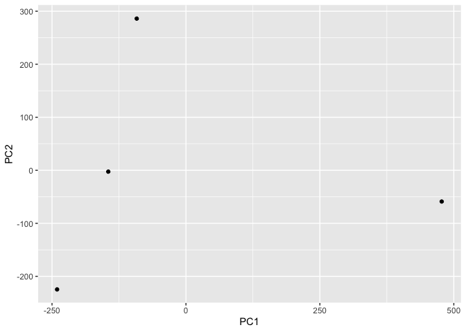

``` r
mycols <- c("orange", "red", "blue", "darkgreen")
ggplot(pca$x) + 
  aes(PC1, PC2) +
  geom_point(col = mycols)
```

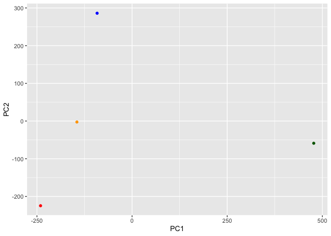

``` r
ggplot(pca$x) + 
  aes(PC1, PC2, label=row.names(pca$x)) +
  geom_point(col = mycols) +
  geom_text(size=3, vjust=2, col=mycols)
```


> Q7. Complete the code below to generate a plot of PC1 vs PC2. The
> second line adds text labels over the data points.

``` r
# Create a data frame for plotting
df <- as.data.frame(pca$x)
df$Country <- rownames(df)

# Plot PC1 vs PC2 with ggplot
ggplot(pca$x) +
  aes(x = PC1, y = PC2, label = rownames(pca$x)) +
  geom_point(size = 3) +
  geom_text(vjust = -0.5) +
  xlim(-270, 500) +
  xlab("PC1") +
  ylab("PC2") +
  theme_bw()
```


> Q8. Customize your plot so that the colors of the country names match
> the colors in our UK and Ireland map and table at start of this
> document.

``` r
df <- as.data.frame(pca$x)
df$Country <- rownames(df)

# Plot PC1 vs PC2 with ggplot
ggplot(pca$x) +
  aes(x = PC1, y = PC2, label = rownames(pca$x)) +
  geom_point(size = 3, col =mycols) +
  geom_text(vjust = -0.5) +
  xlim(-270, 500) +
  xlab("PC1") +
  ylab("PC2") +
  theme_bw()
```

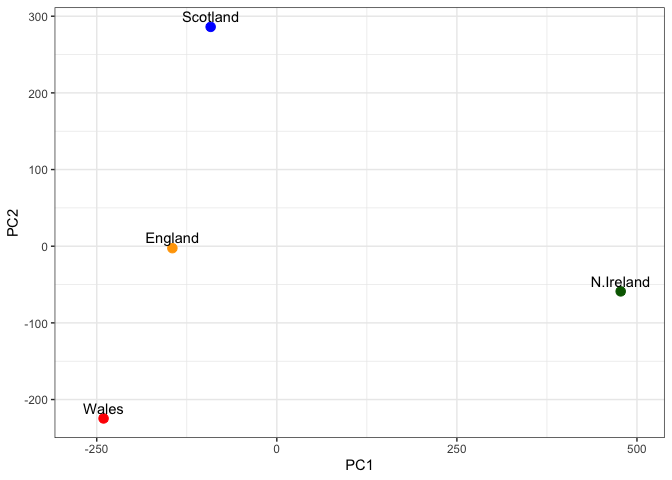

``` r
ggplot(pca$rotation) +
  aes(PC1,reorder(row.names(pca$rotation), PC1)) +
  geom_col()
```

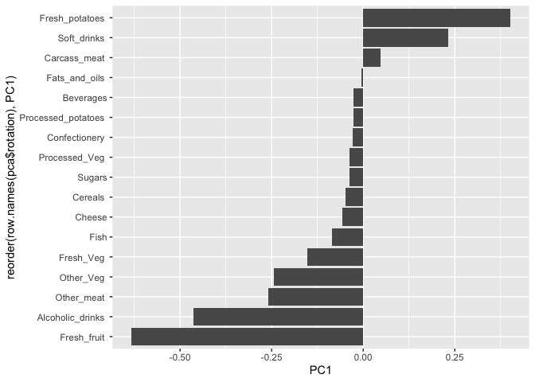

> Q9. Generate a similar ‘loadings plot’ for PC2. What two food groups
> feature prominantely and what does PC2 maninly tell us about?

Fresh potatoes and soft drinks feature prominently, PC2 tells us about
the next biggest pattern of variation independent from PC1.

``` r
ggplot(pca$rotation) +
  aes(PC2, reorder(row.names(pca$rotation), PC2)) +
  geom_col()
```

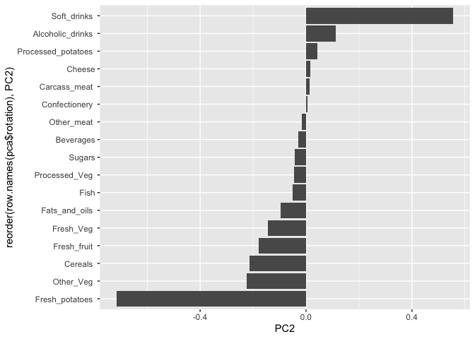

A **PC score plot** shows how samples are positioned along principal
components (revealing clustering and variation), while a **loading
plot** shows which variables drive those components; together, the
loadings explain *why* samples appear where they do in the score plot.
