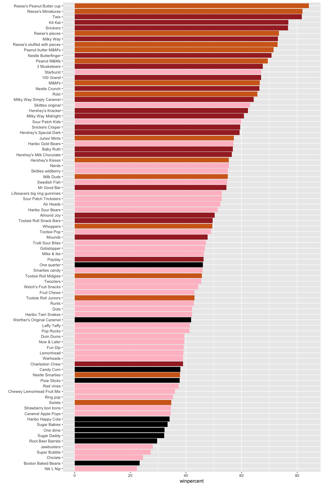
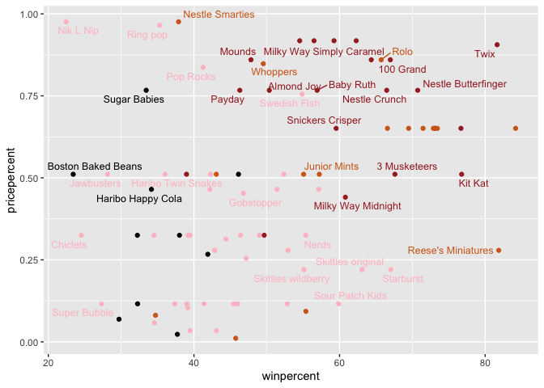
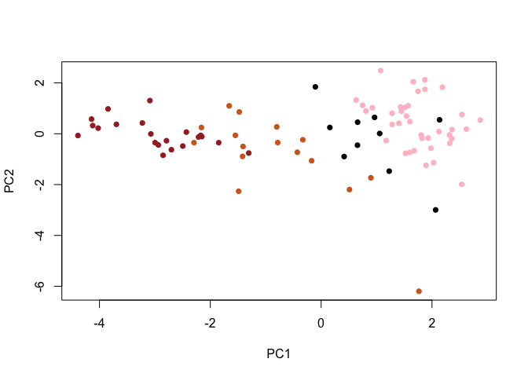
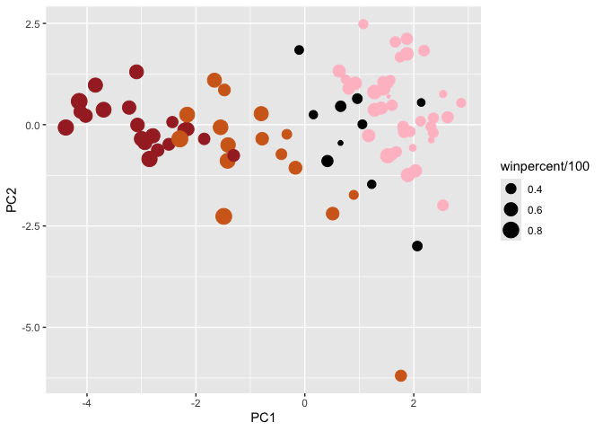
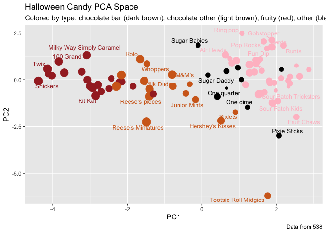
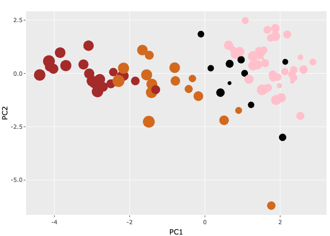
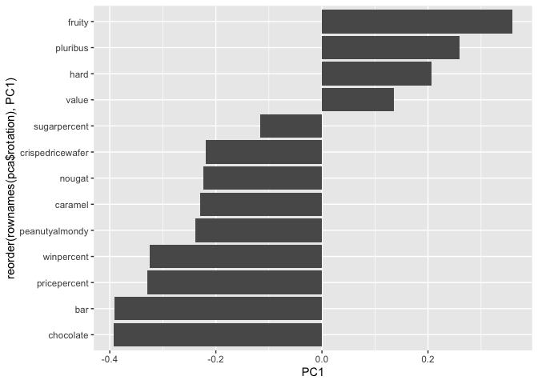

# Class 09: Candy Mini Project
Aarav Prasad (PID: A17440940)

- [Background](#background)
- [Importing candy data](#importing-candy-data)
- [Exploratory analysis](#exploratory-analysis)
- [Overall Candy Rankings](#overall-candy-rankings)
- [Taking a look at pricepercent](#taking-a-look-at-pricepercent)
- [Exploring the correlation
  structure](#exploring-the-correlation-structure)
- [Principal Component Analysis](#principal-component-analysis)
- [Summary](#summary)

## Background

Today we are taking a small detour to analyze a fun dataset that we have
more intrinsic insight into. We will be using principal component
analysis.Building on your work with PCA in the previous labs (UK Foods,
RNA-seq and beast cancer biopsy analysis), this mini-project gives you
the opportunity to apply your data analysis skills to a new, tastier
dataset.

## Importing candy data

``` r
candy_file <- "candy-data.txt"

candy = read.csv(candy_file, row.names = 1)
head(candy)
```

                 chocolate fruity caramel peanutyalmondy nougat crispedricewafer
    100 Grand            1      0       1              0      0                1
    3 Musketeers         1      0       0              0      1                0
    One dime             0      0       0              0      0                0
    One quarter          0      0       0              0      0                0
    Air Heads            0      1       0              0      0                0
    Almond Joy           1      0       0              1      0                0
                 hard bar pluribus sugarpercent pricepercent winpercent
    100 Grand       0   1        0        0.732        0.860   66.97173
    3 Musketeers    0   1        0        0.604        0.511   67.60294
    One dime        0   0        0        0.011        0.116   32.26109
    One quarter     0   0        0        0.011        0.511   46.11650
    Air Heads       0   0        0        0.906        0.511   52.34146
    Almond Joy      0   1        0        0.465        0.767   50.34755

The dataset includes all sorts of information about different kinds of
candy. For example, is a candy chocolaty? Does it have nougat? How does
its cost compare to other candies? How many people prefer one candy over
another?

> Q1: How many different candy types are in this dataset?

``` r
nrow(candy)
```

    [1] 85

> Q2: How many fruity candy types are in the dataset?

``` r
sum(candy$fruity)
```

    [1] 38

One of the most interesting variables in the dataset is `winpercent`.
For a given candy this value is the percentage of people who prefer this
candy over another randomly chosen candy from the dataset (what 538 term
a matchup). Higher values indicate a more popular candy.

``` r
candy["Twix", ]$winpercent
```

    [1] 81.64291

> Q3: What is your favorite candy (other than Twix) in the dataset and
> what is it’s `winpercent` value?

``` r
candy["3 Musketeers", ]$winpercent
```

    [1] 67.60294

> Q4: What is the winpercent value for “Kit Kat”?

``` r
library(dplyr)
```


    Attaching package: 'dplyr'

    The following objects are masked from 'package:stats':

        filter, lag

    The following objects are masked from 'package:base':

        intersect, setdiff, setequal, union

``` r
candy |> 
  filter(row.names(candy)=="Kit Kat") |> 
  select(winpercent)
```

            winpercent
    Kit Kat    76.7686

> Q5: What is the winpercent value for “Tootsie Roll Snack Bars”?

``` r
candy["Tootsie Roll Snack Bars", ]$winpercent
```

    [1] 49.6535

**Side-note**: the `skimr::skim()` function

There is a useful `skim()` function in the **skimr** package that can
help give you a quick overview of a given dataset. Let’s install this
package and try it on our candy data.

``` r
library("skimr")
skim(candy)
```

|                                                  |       |
|:-------------------------------------------------|:------|
| Name                                             | candy |
| Number of rows                                   | 85    |
| Number of columns                                | 12    |
| \_\_\_\_\_\_\_\_\_\_\_\_\_\_\_\_\_\_\_\_\_\_\_   |       |
| Column type frequency:                           |       |
| numeric                                          | 12    |
| \_\_\_\_\_\_\_\_\_\_\_\_\_\_\_\_\_\_\_\_\_\_\_\_ |       |
| Group variables                                  | None  |

Data summary

**Variable type: numeric**

| skim_variable | n_missing | complete_rate | mean | sd | p0 | p25 | p50 | p75 | p100 | hist |
|:---|---:|---:|---:|---:|---:|---:|---:|---:|---:|:---|
| chocolate | 0 | 1 | 0.44 | 0.50 | 0.00 | 0.00 | 0.00 | 1.00 | 1.00 | ▇▁▁▁▆ |
| fruity | 0 | 1 | 0.45 | 0.50 | 0.00 | 0.00 | 0.00 | 1.00 | 1.00 | ▇▁▁▁▆ |
| caramel | 0 | 1 | 0.16 | 0.37 | 0.00 | 0.00 | 0.00 | 0.00 | 1.00 | ▇▁▁▁▂ |
| peanutyalmondy | 0 | 1 | 0.16 | 0.37 | 0.00 | 0.00 | 0.00 | 0.00 | 1.00 | ▇▁▁▁▂ |
| nougat | 0 | 1 | 0.08 | 0.28 | 0.00 | 0.00 | 0.00 | 0.00 | 1.00 | ▇▁▁▁▁ |
| crispedricewafer | 0 | 1 | 0.08 | 0.28 | 0.00 | 0.00 | 0.00 | 0.00 | 1.00 | ▇▁▁▁▁ |
| hard | 0 | 1 | 0.18 | 0.38 | 0.00 | 0.00 | 0.00 | 0.00 | 1.00 | ▇▁▁▁▂ |
| bar | 0 | 1 | 0.25 | 0.43 | 0.00 | 0.00 | 0.00 | 0.00 | 1.00 | ▇▁▁▁▂ |
| pluribus | 0 | 1 | 0.52 | 0.50 | 0.00 | 0.00 | 1.00 | 1.00 | 1.00 | ▇▁▁▁▇ |
| sugarpercent | 0 | 1 | 0.48 | 0.28 | 0.01 | 0.22 | 0.47 | 0.73 | 0.99 | ▇▇▇▇▆ |
| pricepercent | 0 | 1 | 0.47 | 0.29 | 0.01 | 0.26 | 0.47 | 0.65 | 0.98 | ▇▇▇▇▆ |
| winpercent | 0 | 1 | 50.32 | 14.71 | 22.45 | 39.14 | 47.83 | 59.86 | 84.18 | ▃▇▆▅▂ |

> Q6: Is there any variable/column that looks to be on a different scale
> to the majority of the other columns in the dataset?

`winpercent` is on a different scale; it has a mean of 50 and a standard
deviation of 15, while the rest of the columns are between 0 and 1.

> Q7: What do you think a zero and one represent for the
> `candy$chocolate` column?

A zero represents not containing chocolate, a one represents containing
chocolate.

## Exploratory analysis

A good place to start any exploratory analysis is with a histogram. You
can do this most easily with the base R function `hist()`.
Alternatively, you can use `ggplot()` with `geom_hist()`. Either works
well in this case and (as always) its your choice.

> Q8: Plot a histogram of `winpercent` values using both base R and
> ggplot2.

**Base R**

``` r
hist(candy$winpercent)
```


**ggplot2**

``` r
library("ggplot2")

ggplot(candy, aes(x = winpercent)) + geom_histogram(bins = 20)
```


> Q9: Is the distribution of winpercent values symmetrical?

The distribution is not symmetrical, there seems to be a higher
concentration of winpercent values near 40 percent, skewed.

> Q10: Is the center of the distribution above or below 50%?

``` r
summary(candy$winpercent)
```

       Min. 1st Qu.  Median    Mean 3rd Qu.    Max. 
      22.45   39.14   47.83   50.32   59.86   84.18 

The median is a better measure of centrality, and it is below 50%.

> Q11: On average is chocolate candy higher or lower ranked than fruit
> candy?

``` r
mean(candy$winpercent[as.logical(candy$chocolate)])
```

    [1] 60.92153

``` r
mean(candy$winpercent[as.logical(candy$fruity)])
```

    [1] 44.11974

Chocolate is higher ranked on average.

> Q12: Is this difference statistically significant?

``` r
t.test(candy$winpercent[as.logical(candy$chocolate)], candy$winpercent[as.logical(candy$fruity)] )
```


        Welch Two Sample t-test

    data:  candy$winpercent[as.logical(candy$chocolate)] and candy$winpercent[as.logical(candy$fruity)]
    t = 6.2582, df = 68.882, p-value = 2.871e-08
    alternative hypothesis: true difference in means is not equal to 0
    95 percent confidence interval:
     11.44563 22.15795
    sample estimates:
    mean of x mean of y 
     60.92153  44.11974 

It is significant, the p value is \< 0.05.

## Overall Candy Rankings

Let’s use the base R `order()` function together with `head()` to sort
the whole dataset by a variable/column of interest. Or if you have been
getting into the tidyverse and the dplyr package you can use the
`arrange()` function together with `head()` to do the same thing and
answer the following questions:

> Q13: What are the five least liked candy types in this set?

``` r
candy |>
  arrange(winpercent) |>
  head(5)
```

                       chocolate fruity caramel peanutyalmondy nougat
    Nik L Nip                  0      1       0              0      0
    Boston Baked Beans         0      0       0              1      0
    Chiclets                   0      1       0              0      0
    Super Bubble               0      1       0              0      0
    Jawbusters                 0      1       0              0      0
                       crispedricewafer hard bar pluribus sugarpercent pricepercent
    Nik L Nip                         0    0   0        1        0.197        0.976
    Boston Baked Beans                0    0   0        1        0.313        0.511
    Chiclets                          0    0   0        1        0.046        0.325
    Super Bubble                      0    0   0        0        0.162        0.116
    Jawbusters                        0    1   0        1        0.093        0.511
                       winpercent
    Nik L Nip            22.44534
    Boston Baked Beans   23.41782
    Chiclets             24.52499
    Super Bubble         27.30386
    Jawbusters           28.12744

> Q14: What are the top 5 all time favorite candy types out of this set?

``` r
candy |> 
  arrange(desc(winpercent)) |>
  head(5)
```

                              chocolate fruity caramel peanutyalmondy nougat
    Reese's Peanut Butter cup         1      0       0              1      0
    Reese's Miniatures                1      0       0              1      0
    Twix                              1      0       1              0      0
    Kit Kat                           1      0       0              0      0
    Snickers                          1      0       1              1      1
                              crispedricewafer hard bar pluribus sugarpercent
    Reese's Peanut Butter cup                0    0   0        0        0.720
    Reese's Miniatures                       0    0   0        0        0.034
    Twix                                     1    0   1        0        0.546
    Kit Kat                                  1    0   1        0        0.313
    Snickers                                 0    0   1        0        0.546
                              pricepercent winpercent
    Reese's Peanut Butter cup        0.651   84.18029
    Reese's Miniatures               0.279   81.86626
    Twix                             0.906   81.64291
    Kit Kat                          0.511   76.76860
    Snickers                         0.651   76.67378

> Q15: Make a first barplot of candy ranking based on `winpercent`
> values

``` r
ggplot(candy) +
  aes(winpercent, rownames(candy)) +
  geom_col()
```


> Q16: This is quite ugly, use the `reorder()` function to get the bars
> sorted by `winpercent`

``` r
ggplot(candy) +
  aes(winpercent, reorder(rownames(candy), winpercent)) +
  geom_col() 
```


**Time to add some useful color**

Let’s setup a color vector (that signifies candy type) that we can then
use for some future plots. We start by making a vector of all black
values (one for each candy). Then we overwrite chocolate (for chocolate
candy), brown (for candy bars) and red (for fruity candy) values.

``` r
my_cols=rep("black", nrow(candy))

my_cols[as.logical(candy$chocolate)] = "chocolate"

my_cols[as.logical(candy$bar)] = "brown"

my_cols[as.logical(candy$fruity)] = "pink"
```

Now let’s try our barplot with these colors. Note that we use
`fill=my_cols` for `geom_col()`. Experiment to see what happens if you
use `col=mycols`.

``` r
ggplot(candy) + 
  aes(winpercent, reorder(rownames(candy),winpercent)) +
  geom_col(fill=my_cols) +
  ylab("")
```



> Q17: What is the worst ranked chocolate candy?

Sixlets

> Q18: What is the best ranked fruity candy?

Starburst

## Taking a look at pricepercent

What about value for money? What is the best candy for the least money?
One way to get at this would be to make a plot of `winpercent` vs the
`pricepercent` variable. The `pricepercent` variable records the
percentile rank of the candy’s price against all the other candies in
the dataset. Lower values are less expensive and higher values are more
expensive.

``` r
library(ggrepel)

# How about a plot of win vs price
ggplot(candy) +
  aes(x=winpercent, y=pricepercent, label=rownames(candy)) +
  geom_point(col=my_cols) + 
  geom_text_repel(col=my_cols, size=3.3, max.overlaps = 5)
```



> Q19: Which candy type is the highest ranked in terms of `winpercent`
> for the least money - i.e. offers the most bang for your buck?

``` r
candy$value = candy$winpercent / candy$pricepercent
candy[which.max(candy$value), ]
```

                         chocolate fruity caramel peanutyalmondy nougat
    Tootsie Roll Midgies         1      0       0              0      0
                         crispedricewafer hard bar pluribus sugarpercent
    Tootsie Roll Midgies                0    0   0        1        0.174
                         pricepercent winpercent    value
    Tootsie Roll Midgies        0.011   45.73675 4157.886

> Q20: What are the top 5 most expensive candy types in the dataset and
> of these which is the least popular?

``` r
candy[order(candy$pricepercent, decreasing = TRUE),] [1:5,]
```

                             chocolate fruity caramel peanutyalmondy nougat
    Nik L Nip                        0      1       0              0      0
    Nestle Smarties                  1      0       0              0      0
    Ring pop                         0      1       0              0      0
    Hershey's Krackel                1      0       0              0      0
    Hershey's Milk Chocolate         1      0       0              0      0
                             crispedricewafer hard bar pluribus sugarpercent
    Nik L Nip                               0    0   0        1        0.197
    Nestle Smarties                         0    0   0        1        0.267
    Ring pop                                0    1   0        0        0.732
    Hershey's Krackel                       1    0   1        0        0.430
    Hershey's Milk Chocolate                0    0   1        0        0.430
                             pricepercent winpercent    value
    Nik L Nip                       0.976   22.44534 22.99728
    Nestle Smarties                 0.976   37.88719 38.81884
    Ring pop                        0.965   35.29076 36.57073
    Hershey's Krackel               0.918   62.28448 67.84802
    Hershey's Milk Chocolate        0.918   56.49050 61.53649

Nik L Nip is the least popular

## Exploring the correlation structure

We can calculate the pair-wise correlation of all our columns

``` r
library(corrplot)
```

    corrplot 0.95 loaded

``` r
cij <- cor(candy)
corrplot(cij)
```


> Q22: Examining this plot what two variables are anti-correlated
> (i.e. have minus values)?

Chocolate and fruity are strongly anti-correlated. Bar and pluribus are
also anti correlated.

> Q23: Use your corrplot result to make a prediction: which variables do
> you expect will have the largest contributions (i.e. loadings) to PC1
> (i.e., drive the most separation between candies along the first
> principal component)?

`Chocolate` and `fruity` will contribute most to PC1 because they are
strongly negatively correlated and create a major split in the data.
`Winpercent` and `pricepercent` also contribute since they have larger
variation and help capture differences in popularity and cost. Together,
these variables drive the main separation between candies.

## Principal Component Analysis

In this case we want to be sure to set `scale=TRUE` because we have one
variable `winpercent` that is on an very different scale than all others
and would otherwise dominate our PCA results.

``` r
pca <- prcomp(candy, scale = TRUE)
summary(pca)
```

    Importance of components:
                              PC1    PC2     PC3    PC4     PC5     PC6     PC7
    Standard deviation     2.0938 1.2127 1.13054 1.0787 0.98027 0.93656 0.81530
    Proportion of Variance 0.3372 0.1131 0.09832 0.0895 0.07392 0.06747 0.05113
    Cumulative Proportion  0.3372 0.4503 0.54866 0.6382 0.71208 0.77956 0.83069
                               PC8     PC9    PC10    PC11    PC12    PC13
    Standard deviation     0.78462 0.68466 0.66328 0.57829 0.43128 0.39534
    Proportion of Variance 0.04736 0.03606 0.03384 0.02572 0.01431 0.01202
    Cumulative Proportion  0.87804 0.91410 0.94794 0.97367 0.98798 1.00000

Now we can plot our main PCA score plot of PC1 vs PC2.

``` r
plot(pca$x[,1:2])
```


We can change the plotting character and add some color:

``` r
plot(pca$x[,1:2], col=my_cols, pch=16)
```



We can make a much nicer plot with the ggplot2 package but it is
important to note that ggplot works best when you supply an input
data.frame that includes a separate column for each of the aesthetics
you would like displayed in your final plot.

``` r
# Make a new data-frame with our PCA results and candy data
my_data <- cbind(candy, pca$x[,1:3])

p <- ggplot(my_data) + 
  aes(x = PC1, y = PC2, 
      size = winpercent/100,  
      text = rownames(my_data),
      label = rownames(my_data)) +
  geom_point(col = my_cols)

p
```



Again we can use the ggrepel package and the function
`ggrepel::geom_text_repel()` to label up the plot with non overlapping
candy names like. We will also add a title and subtitle like so:

``` r
library(ggrepel)

p + geom_text_repel(size=3.3, col=my_cols, max.overlaps = 7)  + 
  theme(legend.position = "none") +
  labs(title="Halloween Candy PCA Space",
       subtitle="Colored by type: chocolate bar (dark brown), chocolate other (light brown), fruity (red), other (black)",
       caption="Data from 538")
```



If you want to see more candy labels you can change the `max.overlaps`
value to allow more overlapping labels or pass the `ggplot` object p to
plotly like so to generate an interactive plot that you can mouse over
to see labels:

``` r
library(plotly)
```


    Attaching package: 'plotly'

    The following object is masked from 'package:ggplot2':

        last_plot

    The following object is masked from 'package:stats':

        filter

    The following object is masked from 'package:graphics':

        layout

``` r
ggplotly(p)
```



Let’s finish by taking a quick look at PCA our loadings. Do these make
sense to you? Notice the opposite effects of `chocolate` and `fruity`
and the similar effects of `chocolate` and `bar` (i.e. we already know
they are correlated).

``` r
ggplot(pca$rotation) +
  aes(x = PC1, y = reorder(rownames(pca$rotation), PC1)) +
  geom_col()
```



> Q24: Complete the code to generate the loadings plot above. What
> original variables are picked up strongly by PC1 in the positive
> direction? Do these make sense to you? Where did you see this
> relationship highlighted previously?

The variables picked up strongly in the positive direction of PC1 are
`fruity`, `pluribus`, and `hard`. These make sense because they
represent a group of non-chocolate, often bagged or hard candies, which
contrasts with chocolate-based candies.

We previously saw this relationship in the correlation plot, where
`fruity` and `chocolate` were strongly negatively correlated, showing
the same separation that PC1 is capturing.

## Summary

The PCA loadings revealed that the primary axis of variation separates
chocolate-based candies from `fruity` ones - the same pattern we
observed in the correlation matrix, now visualized in a single,
interpretable plot.

> Q25: Based on your exploratory analysis, correlation findings, and PCA
> results, what combination of characteristics appears to make a
> “winning” candy? How do these different analyses (visualization,
> correlation, PCA) support or complement each other in reaching this
> conclusion?

A “winning” candy is typically chocolate-based, often a bar, and not
`fruity`, with higher winpercent and reasonable price. Visualizations
showed chocolate candies clustering at higher popularity, while the
correlation plot highlighted the strong negative relationship between
`chocolate` and `fruity`. PCA confirmed this pattern by separating
candies along PC1 based on `chocolate` vs `fruity`, reinforcing that
candy type is the main driver of preference.
