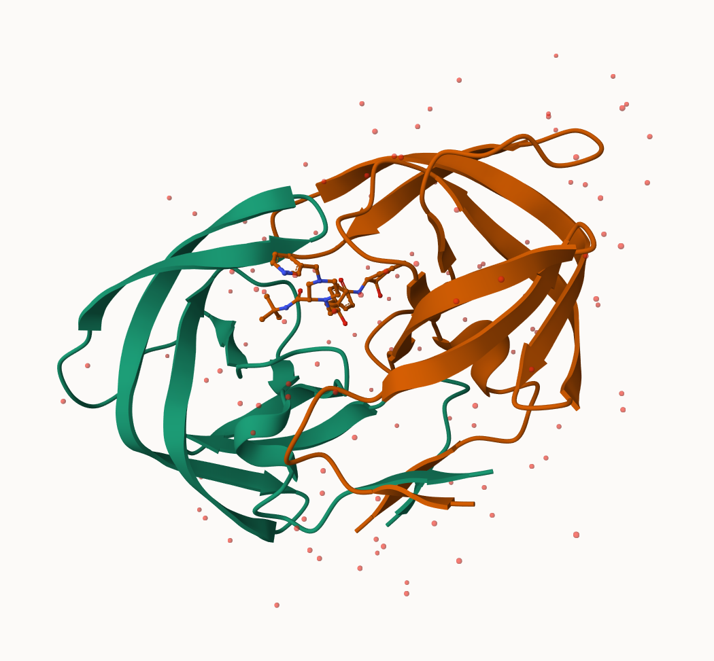
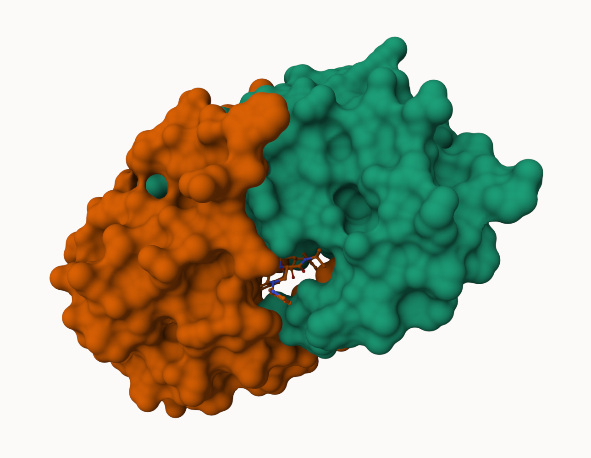
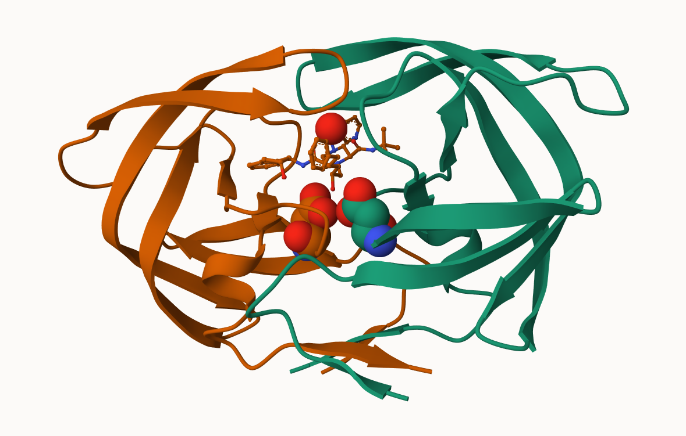

## Background

The main repository of high-resolution structural data on biomolecules is called the **Protein Data Bank** (PDB). 

## PDB statistics

What is in the PDB in terms of molecule type and structure determination method?

Read a CSV file of current PDB stats obtained from https://www.rcsb.org/stats/summary

```{r}
 pdb <- read.csv("Data Export Summary.csv")
pdb
```

>Q1: What percentage of structures in the PDB are solved by X-Ray and Electron Microscopy.

```{r}
pdb$X.ray
```

This print out above `pdb$X.ray` is "character" not "numeric". Therefore I can't do math with it.

```{r}
# We want to get rid / sub out commas: 

x<- pdb$X.ray
tmp <- sub("," ,"", x)
sum(as.numeric(tmp))
        
```

We could make a function to do ths:

```{r}
rm.comma <- function(x) {
  tmp <- sub("," ,"", x)
  sum(as.numeric(tmp))
}
```

```{r}
rm.comma(pdb$EM)
```


We could also use a different import function for this CSV that speaks American (i.e. dieals with commas in numbers in a comma separated value file). 


```{r}
library(readr)

pdb <-read_csv("Data Export Summary.csv")
pdb
```

```{r}
n.tot <- sum(pdb$Total)
n.xray <- sum(pdb$`X-ray`)
n.em <- sum(pdb$`EM`)

xray_pct <- n.xray / n.tot * 100
em_pct <- n.em / n.tot * 100
xray_pct
em_pct
```


>Q2: What proportion of structures in the PDB are protein? How many total proteins?

```{r}
pdb$Total[1]
pdb$Total[1] / n.tot
```

The total number of protein sequences in Uniprot is 202,556,314

```{r}
217375 / 202556314 * 100
```

> Q3: Type HIV in the PDB website search box on the home page and determine how many HIV-1 protease structures are in the current PDB?

There are ~1200 HIV-1 protease structures in the current PDB

> **Key-point**: We have a very, very small structural coverage of known proteins (0.1%). Most structures we know about (80%) come from one method (X-ray crystalography)


## Visualizing PDB data with Mol-star

Main stand alone web version with all features is at https://molstar.org/viewer/







>Q4:Water molecules normally have 3 atoms. Why do we see just one atom per water molecule in this structure?

Hydrogen atoms are usually not visible in X-ray structures because at typical resolutions (~2 Å), their electron density is too weak to detect, so only the oxygen atom of water is shown.


>Q5: There is a critical “conserved” water molecule in the binding site. Can you identify this water molecule? What residue number does this water molecule have

Residue 308

>Q6: Generate and save a figure clearly showing the two distinct chains of HIV-protease along with the ligand. You might also consider showing the catalytic residues ASP 25 in each chain and the critical water (we recommend “Ball & Stick” for these side-chains). Add this figure to your Quarto document.

See figures above

## Getting started with the Bio3d package

Bio3D is an R package from CRAN for structural bioinformatics

```{r}
library(bio3d)

pdb <- read.pdb("1hsg")
pdb
```
>Q7: How many amino acid residues are there in this pdb object?

198

>Q8: Name one of the two non-protein residues?

HOH

>Q9: How many protein chains are in this structure?

2 chains


```{r}
attributes(pdb)
```
```{r}
head(pdb$atom)
```

There are lots of functions that can work with these `pdb` objects:

```{r}
head(pdbseq(pdb))
```

We can have a quick interactive view of any of these `pdb` objects:

```{r}
library(bio3dview)

view.pdb(pdb)
```

Let's try a custom view

```{r}
view.pdb(pdb,
         colorScheme="sse",
         backgroundColor = "black")
```


>Q. Create a custom view highlighting the active site ASP (`resno=25`), the two chains (in your choice of colors) and the ligand all on a custom background.

```{r}
library(NGLVieweR)
active.site <- atom.select(pdb, resno=25)

view.pdb(pdb,
         cols = c("red", "blue"),
         highlight = active.site,
         highlight.style = "spacefill",
         backgroundColor = "pink") |>
  setRock()
```


## Predict the fliexibility of a given structure

Let's do a Normal Mode Analysis (NMA) to predict the flexibility of a given `pdb` object:

```{r}
adk <- read.pdb("6s36")
adk
```

```{r}
m <- nma(adk)
plot(m)
```

```{r}
view.nma(m)
```

Write out the results for viewing in Mol-star:

```{r}
mktrj(m, file="nma.pdb")
```


## Comparative analysis of the ADK family

We will begin by first installing the packages we need for today’s session.

Install packages in the R console NOT your Rmd/Quarto file

install.packages("bio3d")
install.packages("NGLVieweR")

install.packages("remotes")
remotes::install_github("bioboot/bio3dview")

install.packages("BiocManager")
BiocManager::install("msa")


>Q10. Which of the packages above is found only on BioConductor and not CRAN?

`msa`

>Q11. Which of the above packages is not found on BioConductor or CRAN?:

`bio3dview`

>Q12:True or False? Functions from the pak package can be used to install packages from GitHub and BitBucket? 

True


Our first step is find a sequence for this family. We will use the database ID "1ake_A" here:

```{r}
id <- "1ake_A"

aa <- get.seq(id)
aa
```

>Q13. How many amino acids are in this sequence, i.e. how long is this sequence?

214

Search for related sequences in the database

```{r}
blast <- blast.pdb(aa)
```

```{r}
head(blast$hit.tbl)
```

```{r}
hits <-plot(blast)
```


```{r}
hits$pdb.id
```

```{r}
files <- get.pdb(hits$pdb.id, path = "pdbs", split=TRUE, gzip=TRUE)
```


Align and supperpose all these ADK structures

```{r}
pdbs <- pdbaln(files, fit = TRUE, exefile="msa")
```

```{r}
pdbs
```


Quick interactive structural view 

```{r}
view.pdbs(pdbs)
```


PCA of all this structural data (x, y and z atom coordinates):

```{r}
pc <- pca(pdbs)
plot(pc)
```


```{r}
plot(pc, 1:2)
```


Interactive view of the PC1 captured structural differences

```{r}
view.pca(pc)
```


```{r}
mktrj(pc, file = "pca.pdb")
```


