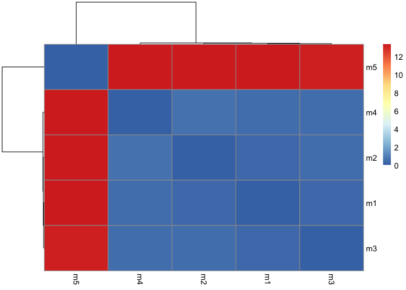
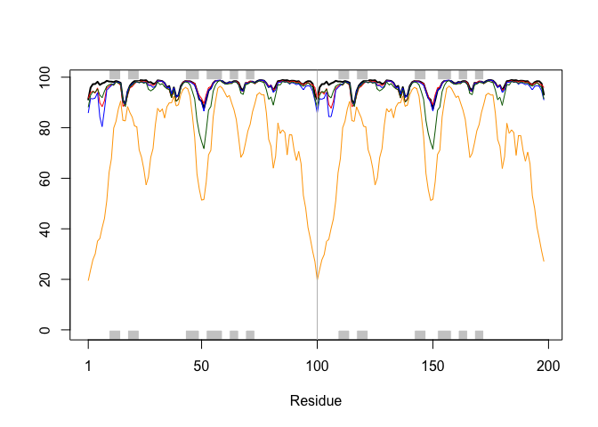
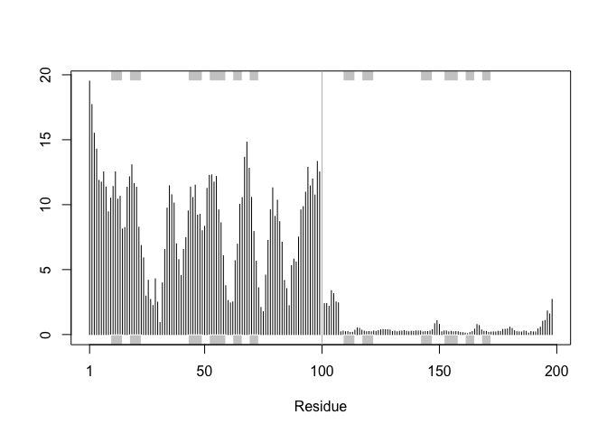
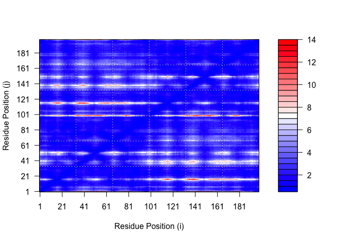
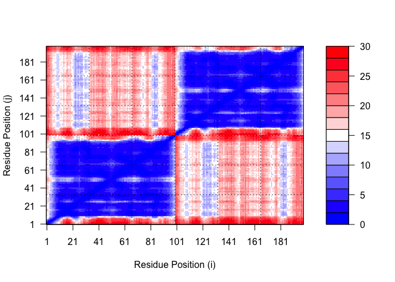
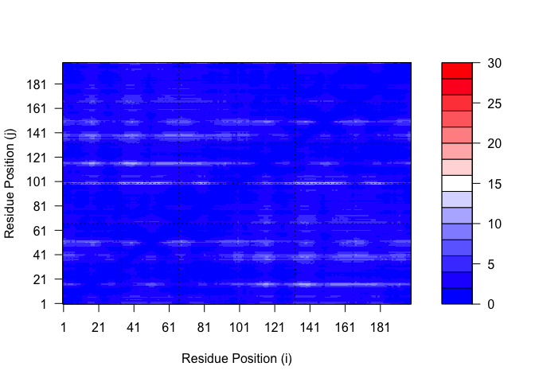

# Class 11: AlphaFold
Aarav Prasad (PID: A17440940)

``` r
library(bio3d)

pdb <- read.pdb("hivpr_dimer_23119/hivpr_dimer_23119_unrelaxed_rank_002_alphafold2_multimer_v3_model_4_seed_000.pdb")

pdb
```


     Call:  read.pdb(file = "hivpr_dimer_23119/hivpr_dimer_23119_unrelaxed_rank_002_alphafold2_multimer_v3_model_4_seed_000.pdb")

       Total Models#: 1
         Total Atoms#: 1514,  XYZs#: 4542  Chains#: 2  (values: A B)

         Protein Atoms#: 1514  (residues/Calpha atoms#: 198)
         Nucleic acid Atoms#: 0  (residues/phosphate atoms#: 0)

         Non-protein/nucleic Atoms#: 0  (residues: 0)
         Non-protein/nucleic resid values: [ none ]

       Protein sequence:
          PQITLWQRPLVTIKIGGQLKEALLDTGADDTVLEEMSLPGRWKPKMIGGIGGFIKVRQYD
          QILIEICGHKAIGTVLVGPTPVNIIGRNLLTQIGCTLNFPQITLWQRPLVTIKIGGQLKE
          ALLDTGADDTVLEEMSLPGRWKPKMIGGIGGFIKVRQYDQILIEICGHKAIGTVLVGPTP
          VNIIGRNLLTQIGCTLNF

    + attr: atom, xyz, calpha, call

Make a vector of input PDB file names that we can read into R

``` r
results_dir <- "hivpr_dimer_23119/"

pdb_files <- list.files(path=results_dir,
           pattern = "pdb",
           full.names = TRUE)

basename(pdb_files)
```

    [1] "hivpr_dimer_23119_unrelaxed_rank_001_alphafold2_multimer_v3_model_2_seed_000.pdb"
    [2] "hivpr_dimer_23119_unrelaxed_rank_002_alphafold2_multimer_v3_model_4_seed_000.pdb"
    [3] "hivpr_dimer_23119_unrelaxed_rank_003_alphafold2_multimer_v3_model_1_seed_000.pdb"
    [4] "hivpr_dimer_23119_unrelaxed_rank_004_alphafold2_multimer_v3_model_5_seed_000.pdb"
    [5] "hivpr_dimer_23119_unrelaxed_rank_005_alphafold2_multimer_v3_model_3_seed_000.pdb"

``` r
library(bio3d)

# Read all data from Models 
#  and superpose/fit coords
pdbs <- pdbaln(pdb_files, fit=TRUE, exefile="msa")
```

    Reading PDB files:
    hivpr_dimer_23119//hivpr_dimer_23119_unrelaxed_rank_001_alphafold2_multimer_v3_model_2_seed_000.pdb
    hivpr_dimer_23119//hivpr_dimer_23119_unrelaxed_rank_002_alphafold2_multimer_v3_model_4_seed_000.pdb
    hivpr_dimer_23119//hivpr_dimer_23119_unrelaxed_rank_003_alphafold2_multimer_v3_model_1_seed_000.pdb
    hivpr_dimer_23119//hivpr_dimer_23119_unrelaxed_rank_004_alphafold2_multimer_v3_model_5_seed_000.pdb
    hivpr_dimer_23119//hivpr_dimer_23119_unrelaxed_rank_005_alphafold2_multimer_v3_model_3_seed_000.pdb
    .....

    Extracting sequences

    pdb/seq: 1   name: hivpr_dimer_23119//hivpr_dimer_23119_unrelaxed_rank_001_alphafold2_multimer_v3_model_2_seed_000.pdb 
    pdb/seq: 2   name: hivpr_dimer_23119//hivpr_dimer_23119_unrelaxed_rank_002_alphafold2_multimer_v3_model_4_seed_000.pdb 
    pdb/seq: 3   name: hivpr_dimer_23119//hivpr_dimer_23119_unrelaxed_rank_003_alphafold2_multimer_v3_model_1_seed_000.pdb 
    pdb/seq: 4   name: hivpr_dimer_23119//hivpr_dimer_23119_unrelaxed_rank_004_alphafold2_multimer_v3_model_5_seed_000.pdb 
    pdb/seq: 5   name: hivpr_dimer_23119//hivpr_dimer_23119_unrelaxed_rank_005_alphafold2_multimer_v3_model_3_seed_000.pdb 

RMSD is a standard measure of structural distance between coordinate
sets. We can use the `rmsd()` function to calculate the RMSD between all
pairs models.

``` r
rd <- rmsd(pdbs, fit=T)
```

    Warning in rmsd(pdbs, fit = T): No indices provided, using the 198 non NA positions

``` r
range(rd)
```

    [1]  0.000 13.376

Draw a heatmap of these RMSD matrix values

``` r
library(pheatmap)

colnames(rd) <- paste0("m",1:5)
rownames(rd) <- paste0("m",1:5)
pheatmap(rd)
```



``` r
# Read a reference PDB structure
pdb <- read.pdb("1hsg")
```

      Note: Accessing on-line PDB file

``` r
plotb3(pdbs$b[1,], typ="l", lwd=2, sse=pdb)
points(pdbs$b[2,], typ="l", col="red")
points(pdbs$b[3,], typ="l", col="blue")
points(pdbs$b[4,], typ="l", col="darkgreen")
points(pdbs$b[5,], typ="l", col="orange")
abline(v=100, col="gray")
```



``` r
core <- core.find(pdbs)
```

     core size 197 of 198  vol = 58.625 
     core size 196 of 198  vol = 52.96 
     core size 195 of 198  vol = 49.614 
     core size 194 of 198  vol = 46.269 
     core size 193 of 198  vol = 44.802 
     core size 192 of 198  vol = 43.508 
     core size 191 of 198  vol = 42.246 
     core size 190 of 198  vol = 40.982 
     core size 189 of 198  vol = 39.788 
     core size 188 of 198  vol = 38.576 
     core size 187 of 198  vol = 37.347 
     core size 186 of 198  vol = 36.342 
     core size 185 of 198  vol = 35.226 
     core size 184 of 198  vol = 34.286 
     core size 183 of 198  vol = 33.532 
     core size 182 of 198  vol = 32.75 
     core size 181 of 198  vol = 32.195 
     core size 180 of 198  vol = 31.494 
     core size 179 of 198  vol = 31.013 
     core size 178 of 198  vol = 30.448 
     core size 177 of 198  vol = 29.837 
     core size 176 of 198  vol = 29.536 
     core size 175 of 198  vol = 29.483 
     core size 174 of 198  vol = 29.556 
     core size 173 of 198  vol = 29.367 
     core size 172 of 198  vol = 29.366 
     core size 171 of 198  vol = 29.271 
     core size 170 of 198  vol = 29.272 
     core size 169 of 198  vol = 29.032 
     core size 168 of 198  vol = 28.853 
     core size 167 of 198  vol = 28.495 
     core size 166 of 198  vol = 28.045 
     core size 165 of 198  vol = 27.445 
     core size 164 of 198  vol = 26.7 
     core size 163 of 198  vol = 26.022 
     core size 162 of 198  vol = 25.412 
     core size 161 of 198  vol = 24.67 
     core size 160 of 198  vol = 24.117 
     core size 159 of 198  vol = 23.679 
     core size 158 of 198  vol = 23.089 
     core size 157 of 198  vol = 22.457 
     core size 156 of 198  vol = 22.038 
     core size 155 of 198  vol = 21.617 
     core size 154 of 198  vol = 21.215 
     core size 153 of 198  vol = 20.757 
     core size 152 of 198  vol = 19.861 
     core size 151 of 198  vol = 19.611 
     core size 150 of 198  vol = 19.177 
     core size 149 of 198  vol = 18.875 
     core size 148 of 198  vol = 18.447 
     core size 147 of 198  vol = 17.829 
     core size 146 of 198  vol = 17.441 
     core size 145 of 198  vol = 17.063 
     core size 144 of 198  vol = 16.662 
     core size 143 of 198  vol = 16.4 
     core size 142 of 198  vol = 15.791 
     core size 141 of 198  vol = 15.113 
     core size 140 of 198  vol = 14.581 
     core size 139 of 198  vol = 14.037 
     core size 138 of 198  vol = 13.63 
     core size 137 of 198  vol = 12.821 
     core size 136 of 198  vol = 12.496 
     core size 135 of 198  vol = 12.232 
     core size 134 of 198  vol = 11.95 
     core size 133 of 198  vol = 11.705 
     core size 132 of 198  vol = 11.36 
     core size 131 of 198  vol = 10.983 
     core size 130 of 198  vol = 10.545 
     core size 129 of 198  vol = 9.983 
     core size 128 of 198  vol = 9.562 
     core size 127 of 198  vol = 9.27 
     core size 126 of 198  vol = 8.703 
     core size 125 of 198  vol = 8.091 
     core size 124 of 198  vol = 7.644 
     core size 123 of 198  vol = 7.291 
     core size 122 of 198  vol = 6.936 
     core size 121 of 198  vol = 6.575 
     core size 120 of 198  vol = 6.114 
     core size 119 of 198  vol = 5.689 
     core size 118 of 198  vol = 5.281 
     core size 117 of 198  vol = 4.892 
     core size 116 of 198  vol = 4.582 
     core size 115 of 198  vol = 4.307 
     core size 114 of 198  vol = 4.056 
     core size 113 of 198  vol = 3.72 
     core size 112 of 198  vol = 3.561 
     core size 111 of 198  vol = 3.409 
     core size 110 of 198  vol = 3.276 
     core size 109 of 198  vol = 3.035 
     core size 108 of 198  vol = 2.97 
     core size 107 of 198  vol = 2.859 
     core size 106 of 198  vol = 2.784 
     core size 105 of 198  vol = 2.484 
     core size 104 of 198  vol = 2.279 
     core size 103 of 198  vol = 2.203 
     core size 102 of 198  vol = 2.111 
     core size 101 of 198  vol = 2.002 
     core size 100 of 198  vol = 1.905 
     core size 99 of 198  vol = 1.788 
     core size 98 of 198  vol = 1.673 
     core size 97 of 198  vol = 1.526 
     core size 96 of 198  vol = 1.403 
     core size 95 of 198  vol = 1.165 
     core size 94 of 198  vol = 0.987 
     core size 93 of 198  vol = 0.803 
     core size 92 of 198  vol = 0.727 
     core size 91 of 198  vol = 0.587 
     core size 90 of 198  vol = 0.525 
     core size 89 of 198  vol = 0.396 
     FINISHED: Min vol ( 0.5 ) reached

``` r
core.inds <- print(core, vol=0.5)
```

    # 90 positions (cumulative volume <= 0.5 Angstrom^3) 
      start end length
    1     9  49     41
    2    52  78     27
    3    80  97     18

``` r
xyz <- pdbfit(pdbs, core.inds, outpath="corefit_structures")
```

Now we can examine the RMSF between positions of the structure. RMSF is
an often used measure of conformational variance along the structure:

``` r
rf <- rmsf(xyz)

plotb3(rf, sse=pdb)
abline(v=100, col="gray", ylab="RMSF")
```



## Predicted Alignment Error for domains

Independent of the 3D structure, AlphaFold produces an output called
Predicted Aligned Error (PAE). This is detailed in the JSON format
result files, one for each model structure.

Below we read these files and see that AlphaFold produces a useful
inter-domain prediction for model 1 (and 2) but not for model 5 (or
indeed models 3, 4, and 5):

``` r
library(jsonlite)

# Listing of all PAE JSON files
pae_files <- list.files(path=results_dir,
                        pattern=".*model.*\\.json",
                        full.names = TRUE)
```

``` r
pae1 <- read_json(pae_files[1],simplifyVector = TRUE)
pae5 <- read_json(pae_files[5],simplifyVector = TRUE)

attributes(pae1)
```

    $names
    [1] "plddt"   "max_pae" "pae"     "ptm"     "iptm"   

``` r
# Per-residue pLDDT scores 
#  same as B-factor of PDB..
head(pae1$plddt) 
```

    [1] 91.19 95.88 97.25 97.31 98.19 96.94

The maximum PAE values are useful for ranking models. Here we can see
that model 5 is much worse than model 1. The lower the PAE score the
better. How about the other models, what are thir max PAE scores?

``` r
pae1$max_pae
```

    [1] 13.78125

``` r
pae5$max_pae
```

    [1] 30.01562

We can plot the N by N (where N is the number of residues) PAE scores
with ggplot or with functions from the Bio3D package:

``` r
plot.dmat(pae1$pae, 
          xlab="Residue Position (i)",
          ylab="Residue Position (j)")
```



``` r
plot.dmat(pae5$pae, 
          xlab="Residue Position (i)",
          ylab="Residue Position (j)",
          grid.col = "black",
          zlim=c(0,30))
```



We should really plot all of these using the same z range. Here is the
model 1 plot again but this time using the same data range as the plot
for model 5:

``` r
plot.dmat(pae1$pae, 
          xlab="Residue Position (i)",
          ylab="Residue Position (j)",
          grid.col = "black",
          zlim=c(0,30))
```



## Residue convservation from alignment file

``` r
aln_file <- list.files(path=results_dir,
                       pattern=".a3m$",
                        full.names = TRUE)
aln_file
```

    [1] "hivpr_dimer_23119//hivpr_dimer_23119.a3m"

``` r
aln <- read.fasta(aln_file[1], to.upper = TRUE)
```

    [1] " ** Duplicated sequence id's: 101 **"
    [2] " ** Duplicated sequence id's: 101 **"

How many sequences are in this allignment

``` r
dim(aln$ali)
```

    [1] 5397  132

We can score residue conservation in the alignment with the `conserv()`
function

``` r
sim <- conserv(aln)
plotb3(sim[1:99], sse=trim.pdb(pdb, chain="A"),
       ylab="Conservation Score")
```


Note the conserved Active Site residues D25, T26, G27, A28. These
positions will stand out if we generate a consensus sequence with a high
cutoff value:

``` r
con <- consensus(aln, cutoff = 0.9)
con$seq
```

      [1] "-" "-" "-" "-" "-" "-" "-" "-" "-" "-" "-" "-" "-" "-" "-" "-" "-" "-"
     [19] "-" "-" "-" "-" "-" "-" "D" "T" "G" "A" "-" "-" "-" "-" "-" "-" "-" "-"
     [37] "-" "-" "-" "-" "-" "-" "-" "-" "-" "-" "-" "-" "-" "-" "-" "-" "-" "-"
     [55] "-" "-" "-" "-" "-" "-" "-" "-" "-" "-" "-" "-" "-" "-" "-" "-" "-" "-"
     [73] "-" "-" "-" "-" "-" "-" "-" "-" "-" "-" "-" "-" "-" "-" "-" "-" "-" "-"
     [91] "-" "-" "-" "-" "-" "-" "-" "-" "-" "-" "-" "-" "-" "-" "-" "-" "-" "-"
    [109] "-" "-" "-" "-" "-" "-" "-" "-" "-" "-" "-" "-" "-" "-" "-" "-" "-" "-"
    [127] "-" "-" "-" "-" "-" "-"

``` r
m1.pdb <- read.pdb(pdb_files[1])
occ <- vec2resno(c(sim[1:99], sim[1:99]), m1.pdb$atom$resno)
write.pdb(m1.pdb, o=occ, file="m1_conserv.pdb")
```
