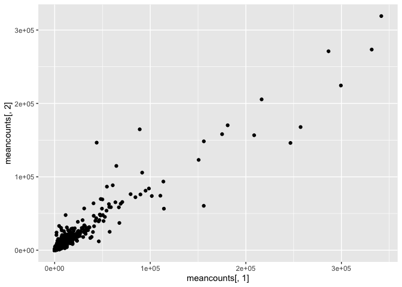
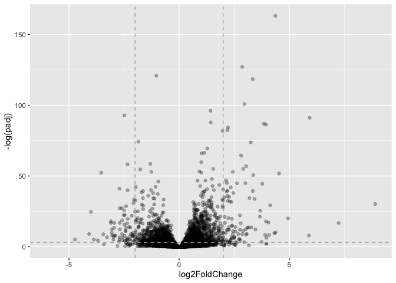

# Class 13: RNASeq analysis with DESeq
Aarav Prasad (PID: A17440940)

- [Background](#background)
- [Data Import](#data-import)
- [DESeq analysis](#deseq-analysis)
- [Volcano plot](#volcano-plot)
- [Save our results to date](#save-our-results-to-date)
- [Adding annotation data](#adding-annotation-data)
- [Pathway analysis](#pathway-analysis)
- [Save our annotated results](#save-our-annotated-results)

## Background

Today we’re going to do an RNA-seq analysis of a data set on the common
glucocorticoid steroid dexamethasone (dex), and we’ll use DESeq for this
analysis

## Data Import

Let’s read the `count` data and the `metadata` about this experiment
setup from the supplied csv files:

``` r
counts <- read.csv("airway_scaledcounts.csv", row.names = 1)
metadata <- read.csv("airway_metadata.csv")
```

``` r
head(counts)
```

                    SRR1039508 SRR1039509 SRR1039512 SRR1039513 SRR1039516
    ENSG00000000003        723        486        904        445       1170
    ENSG00000000005          0          0          0          0          0
    ENSG00000000419        467        523        616        371        582
    ENSG00000000457        347        258        364        237        318
    ENSG00000000460         96         81         73         66        118
    ENSG00000000938          0          0          1          0          2
                    SRR1039517 SRR1039520 SRR1039521
    ENSG00000000003       1097        806        604
    ENSG00000000005          0          0          0
    ENSG00000000419        781        417        509
    ENSG00000000457        447        330        324
    ENSG00000000460         94        102         74
    ENSG00000000938          0          0          0

The metadata tells us what is actually in the columns of our `counts`
object

``` r
head(metadata)
```

              id     dex celltype     geo_id
    1 SRR1039508 control   N61311 GSM1275862
    2 SRR1039509 treated   N61311 GSM1275863
    3 SRR1039512 control  N052611 GSM1275866
    4 SRR1039513 treated  N052611 GSM1275867
    5 SRR1039516 control  N080611 GSM1275870
    6 SRR1039517 treated  N080611 GSM1275871

> Q1. How many genes are in this dataset?

There are 38694 genes in this dataset

> Q2. How many ‘control’ cell lines do we have?

``` r
sum(metadata$dex == "control")
```

    [1] 4

``` r
table(metadata$dex)
```


    control treated 
          4       4 

``` r
colnames(counts) == metadata$id
```

    [1] TRUE TRUE TRUE TRUE TRUE TRUE TRUE TRUE

- Find the “control” columns in out `counts` object
- Extract just the “control” column values for all genes
- Calculate the average value per gene in these “control” columns

``` r
control.inds <- metadata$dex == "control"
control.counts <- counts[ , control.inds]
control.mean <- rowMeans(control.counts)
```

``` r
head(control.mean)
```

    ENSG00000000003 ENSG00000000005 ENSG00000000419 ENSG00000000457 ENSG00000000460 
             900.75            0.00          520.50          339.75           97.25 
    ENSG00000000938 
               0.75 

> Q3. How would you make the above code in either approach more robust?
> Is there a function that could help here?

We used the rowMeans() function

> Q4.Now do the same for the “treated” column

``` r
treated.inds <- metadata$dex == "treated"
treated.counts <- counts[, treated.inds]
treated.mean <- rowMeans(treated.counts)
```

``` r
head(treated.mean)
```

    ENSG00000000003 ENSG00000000005 ENSG00000000419 ENSG00000000457 ENSG00000000460 
             658.00            0.00          546.00          316.50           78.75 
    ENSG00000000938 
               0.00 

For book-keeping lets store these together as a new object called
`meancounts`

``` r
meancounts <- data.frame(control.mean, treated.mean)
```

> Q5 (a). Create a scatter plot showing the mean of the treated samples
> against the mean of the control samples. Your plot should look
> something like the following.

``` r
plot(meancounts[,1],meancounts[,2], xlab="Control", ylab="Treated")
```


> Q5 (b).You could also use the ggplot2 package to make this figure
> producing the plot below. What geom\_?() function would you use for
> this plot?

``` r
library(ggplot2)

ggplot(meancounts) +
  aes(meancounts[,1],meancounts[,2]) +
  geom_point()
```



Our count data has too many objects, screams log transform

> Q6. Try plotting both axes on a log scale. What is the argument to
> plot() that allows you to do this?

``` r
plot(meancounts, log="xy")
```

    Warning in xy.coords(x, y, xlabel, ylabel, log): 15032 x values <= 0 omitted
    from logarithmic plot

    Warning in xy.coords(x, y, xlabel, ylabel, log): 15281 y values <= 0 omitted
    from logarithmic plot


We most often use log2 transform for this kind of data in bioinformatics
because it makes my brain hurt less

``` r
#Treated / Control

log2( 20 / 20 )
```

    [1] 0

``` r
log2(40/20)
```

    [1] 1

``` r
log2( 20 / 40 )
```

    [1] -1

``` r
log2(80 / 20 )
```

    [1] 2

We call this little fraction the “log2 fold change” as it tells us how
much more or less gene expression we have in units of doubling, etc

Lets calculate the log2 fold change for our `treated.mean` and
`control.mean` counts and call this `log2fc`.

``` r
meancounts$log2fc <- log2(meancounts$treated.mean / meancounts$control.mean)

head(meancounts)
```

                    control.mean treated.mean      log2fc
    ENSG00000000003       900.75       658.00 -0.45303916
    ENSG00000000005         0.00         0.00         NaN
    ENSG00000000419       520.50       546.00  0.06900279
    ENSG00000000457       339.75       316.50 -0.10226805
    ENSG00000000460        97.25        78.75 -0.30441833
    ENSG00000000938         0.75         0.00        -Inf

A common “rule of thumb” threshold for calling a gene “up regulated” or
“down regulated” is a log2 fold-change value of +2 or -2 (or greater)

``` r
zero.vals <- which(meancounts[,1:2]==0, arr.ind=TRUE)

to.rm <- unique(zero.vals[,1])
mycounts <- meancounts[-to.rm,]
head(mycounts)
```

                    control.mean treated.mean      log2fc
    ENSG00000000003       900.75       658.00 -0.45303916
    ENSG00000000419       520.50       546.00  0.06900279
    ENSG00000000457       339.75       316.50 -0.10226805
    ENSG00000000460        97.25        78.75 -0.30441833
    ENSG00000000971      5219.00      6687.50  0.35769358
    ENSG00000001036      2327.00      1785.75 -0.38194109

> Q7. What is the purpose of the `arr.ind` argument in the which()
> function call above? Why would we then take the first column of the
> output and need to call the unique() function?

This code removes genes with zero expression in either condition so the
log2 fold-change calculation no longer produces NaN or -Inf.

## DESeq analysis

Let’s do this analysis properly and not forget about the significance of
the differences.

For this we will use the **DESeq2** package

``` r
library(DESeq2)
```

To run a DESeq analyis we need at least two inputs:

- `countData` i.e. our gene counts across different experiments
- `colData` i.e. our metadata about those count columns

``` r
dds <- DESeqDataSetFromMatrix(countData = counts,
                              colData = metadata,
                              design =~dex)
```

    converting counts to integer mode

    Warning in DESeqDataSet(se, design = design, ignoreRank): some variables in
    design formula are characters, converting to factors

``` r
dds
```

    class: DESeqDataSet 
    dim: 38694 8 
    metadata(1): version
    assays(1): counts
    rownames(38694): ENSG00000000003 ENSG00000000005 ... ENSG00000283120
      ENSG00000283123
    rowData names(0):
    colnames(8): SRR1039508 SRR1039509 ... SRR1039520 SRR1039521
    colData names(4): id dex celltype geo_id

Now we can run the DESeq analyis pipeline using this `dds` object that
has all the inputs we need

``` r
dds <- DESeq(dds)
```

    estimating size factors

    estimating dispersions

    gene-wise dispersion estimates

    mean-dispersion relationship

    final dispersion estimates

    fitting model and testing

``` r
res <- results(dds)
head(res)
```

    log2 fold change (MLE): dex treated vs control 
    Wald test p-value: dex treated vs control 
    DataFrame with 6 rows and 6 columns
                      baseMean log2FoldChange     lfcSE      stat    pvalue
                     <numeric>      <numeric> <numeric> <numeric> <numeric>
    ENSG00000000003 747.194195      -0.350703  0.168242 -2.084514 0.0371134
    ENSG00000000005   0.000000             NA        NA        NA        NA
    ENSG00000000419 520.134160       0.206107  0.101042  2.039828 0.0413675
    ENSG00000000457 322.664844       0.024527  0.145134  0.168996 0.8658000
    ENSG00000000460  87.682625      -0.147143  0.256995 -0.572550 0.5669497
    ENSG00000000938   0.319167      -1.732289  3.493601 -0.495846 0.6200029
                         padj
                    <numeric>
    ENSG00000000003  0.163017
    ENSG00000000005        NA
    ENSG00000000419  0.175937
    ENSG00000000457  0.961682
    ENSG00000000460  0.815805
    ENSG00000000938        NA

## Volcano plot

This is a ubiquitous and common visualization for this type of data that
puts the log2 fold change and the adjusted p-value together in one plot
that people can get insight for what is going on in the whole dataset
results.

``` r
library(ggplot2)
```

``` r
ggplot(res) + 
  aes(log2FoldChange, padj) +
  geom_point(alpha=0.3)
```

    Warning: Removed 23549 rows containing missing values or values outside the scale range
    (`geom_point()`).


That plot was not very useful because we don’t care about genes with
high p-values

Lets log the y-axis so we can see these genes/points more clearly:

``` r
ggplot(res) + 
  aes(log2FoldChange, -log(padj)) +
  geom_point(alpha=0.3) 
```

    Warning: Removed 23549 rows containing missing values or values outside the scale range
    (`geom_point()`).


To make this more useful we can add some guidelines

``` r
ggplot(res) + 
  aes(log2FoldChange, -log(padj)) +
  geom_point(alpha = 0.3) +
  geom_vline(xintercept = c(-2, 2), color = "darkgray", linetype = 2) +
  geom_hline(yintercept = -log(0.05), color = "darkgray", linetype = 2) 
```

    Warning: Removed 23549 rows containing missing values or values outside the scale range
    (`geom_point()`).



## Save our results to date

``` r
write.csv(res, file= "myresults.csv")
```

## Adding annotation data

We need to “map” or “translate” our ENSEMBLE gene identifiers in our
results object to date to the identifiers used in differentdatabases we
want to use for learning more about these genes

``` r
library(AnnotationDbi)
library(org.Hs.eg.db)
```

We can see the columns in `org.Hs.eg.db` that list the different
databases we can mape between:

``` r
columns(org.Hs.eg.db)
```

     [1] "ACCNUM"       "ALIAS"        "ENSEMBL"      "ENSEMBLPROT"  "ENSEMBLTRANS"
     [6] "ENTREZID"     "ENZYME"       "EVIDENCE"     "EVIDENCEALL"  "GENENAME"    
    [11] "GENETYPE"     "GO"           "GOALL"        "IPI"          "MAP"         
    [16] "OMIM"         "ONTOLOGY"     "ONTOLOGYALL"  "PATH"         "PFAM"        
    [21] "PMID"         "PROSITE"      "REFSEQ"       "SYMBOL"       "UCSCKG"      
    [26] "UNIPROT"     

We can now use the `mapIDs()` function to map between these different
database identifier formats

``` r
res$symbol <- mapIds(org.Hs.eg.db,
                     keys=row.names(res), # Our genenames
                     keytype="ENSEMBL",        # The format of our genenames
                     column="SYMBOL",          # The new format we want to add
                     multiVals="first")
```

    'select()' returned 1:many mapping between keys and columns

``` r
head(res)
```

    log2 fold change (MLE): dex treated vs control 
    Wald test p-value: dex treated vs control 
    DataFrame with 6 rows and 7 columns
                      baseMean log2FoldChange     lfcSE      stat    pvalue
                     <numeric>      <numeric> <numeric> <numeric> <numeric>
    ENSG00000000003 747.194195      -0.350703  0.168242 -2.084514 0.0371134
    ENSG00000000005   0.000000             NA        NA        NA        NA
    ENSG00000000419 520.134160       0.206107  0.101042  2.039828 0.0413675
    ENSG00000000457 322.664844       0.024527  0.145134  0.168996 0.8658000
    ENSG00000000460  87.682625      -0.147143  0.256995 -0.572550 0.5669497
    ENSG00000000938   0.319167      -1.732289  3.493601 -0.495846 0.6200029
                         padj      symbol
                    <numeric> <character>
    ENSG00000000003  0.163017      TSPAN6
    ENSG00000000005        NA        TNMD
    ENSG00000000419  0.175937        DPM1
    ENSG00000000457  0.961682       SCYL3
    ENSG00000000460  0.815805       FIRRM
    ENSG00000000938        NA         FGR

> Q11. Run the mapIds() function two more times to add the Entrez ID and
> UniProt accession and GENENAME as new columns called `res$entrez`,
> `res$uniprot` and `res$genename`.

``` r
res$entrez <- mapIds(org.Hs.eg.db,
                     keys=row.names(res),
                     column="ENTREZID",
                     keytype="ENSEMBL",
                     multiVals="first")
```

    'select()' returned 1:many mapping between keys and columns

``` r
res$uniprot <- mapIds(org.Hs.eg.db,
                     keys=row.names(res),
                     column="UNIPROT",
                     keytype="ENSEMBL",
                     multiVals="first")
```

    'select()' returned 1:many mapping between keys and columns

``` r
res$genename <- mapIds(org.Hs.eg.db,
                     keys=row.names(res),
                     column="GENENAME",
                     keytype="ENSEMBL",
                     multiVals="first")
```

    'select()' returned 1:many mapping between keys and columns

``` r
head(res)
```

    log2 fold change (MLE): dex treated vs control 
    Wald test p-value: dex treated vs control 
    DataFrame with 6 rows and 10 columns
                      baseMean log2FoldChange     lfcSE      stat    pvalue
                     <numeric>      <numeric> <numeric> <numeric> <numeric>
    ENSG00000000003 747.194195      -0.350703  0.168242 -2.084514 0.0371134
    ENSG00000000005   0.000000             NA        NA        NA        NA
    ENSG00000000419 520.134160       0.206107  0.101042  2.039828 0.0413675
    ENSG00000000457 322.664844       0.024527  0.145134  0.168996 0.8658000
    ENSG00000000460  87.682625      -0.147143  0.256995 -0.572550 0.5669497
    ENSG00000000938   0.319167      -1.732289  3.493601 -0.495846 0.6200029
                         padj      symbol      entrez     uniprot
                    <numeric> <character> <character> <character>
    ENSG00000000003  0.163017      TSPAN6        7105  A0A087WYV6
    ENSG00000000005        NA        TNMD       64102      Q9H2S6
    ENSG00000000419  0.175937        DPM1        8813      H0Y368
    ENSG00000000457  0.961682       SCYL3       57147      X6RHX1
    ENSG00000000460  0.815805       FIRRM       55732      A6NFP1
    ENSG00000000938        NA         FGR        2268      B7Z6W7
                                  genename
                               <character>
    ENSG00000000003          tetraspanin 6
    ENSG00000000005            tenomodulin
    ENSG00000000419 dolichyl-phosphate m..
    ENSG00000000457 SCY1 like pseudokina..
    ENSG00000000460 FIGNL1 interacting r..
    ENSG00000000938 FGR proto-oncogene, ..

## Pathway analysis

Now we have our annotated results with their log2 fold-change and
p-values we can figure out which biological pathways and process these
genes are involved with.

We will use the **gage** and **pathview** pachages for this step and
install them with:
`BiocManager::install( c("pathview", "gage", "gageData") )`

``` r
library(pathview)
library(gage)
library(gageData)
```

``` r
data(kegg.sets.hs)
head(kegg.sets.hs, 2)
```

    $`hsa00232 Caffeine metabolism`
    [1] "10"   "1544" "1548" "1549" "1553" "7498" "9"   

    $`hsa00983 Drug metabolism - other enzymes`
     [1] "10"     "1066"   "10720"  "10941"  "151531" "1548"   "1549"   "1551"  
     [9] "1553"   "1576"   "1577"   "1806"   "1807"   "1890"   "221223" "2990"  
    [17] "3251"   "3614"   "3615"   "3704"   "51733"  "54490"  "54575"  "54576" 
    [25] "54577"  "54578"  "54579"  "54600"  "54657"  "54658"  "54659"  "54963" 
    [33] "574537" "64816"  "7083"   "7084"   "7172"   "7363"   "7364"   "7365"  
    [41] "7366"   "7367"   "7371"   "7372"   "7378"   "7498"   "79799"  "83549" 
    [49] "8824"   "8833"   "9"      "978"   

We need a vector of importance (e.g. fold-change values) that has gene
ids as names. These names need to be in the correct format (using the
correct database format for the IDS).

Here we willl make a wee imput vector called `foldchanges` that has
“entrez” ids as names.

``` r
foldchanges <- res$log2FoldChange
names(foldchanges) <- res$entrez
```

Now we can run `gage()` to do our pathway analysis.

``` r
keggres = gage(foldchanges, gsets=kegg.sets.hs)
```

``` r
attributes(keggres)
```

    $names
    [1] "greater" "less"    "stats"  

The top 3 overlapping pathways

``` r
head(keggres$less, 3)
```

                                          p.geomean stat.mean        p.val
    hsa05332 Graft-versus-host disease 0.0004250607 -3.473335 0.0004250607
    hsa04940 Type I diabetes mellitus  0.0017820379 -3.002350 0.0017820379
    hsa05310 Asthma                    0.0020046180 -3.009045 0.0020046180
                                            q.val set.size         exp1
    hsa05332 Graft-versus-host disease 0.09053792       40 0.0004250607
    hsa04940 Type I diabetes mellitus  0.14232788       42 0.0017820379
    hsa05310 Asthma                    0.14232788       29 0.0020046180

Now we can use the **pathview** package with the found KEGG pathway IDs
to make a pathway figure showing our differential expressed genes (DEGs)

``` r
pathview(gene.data=foldchanges, pathway.id="hsa05310")
```

    'select()' returned 1:1 mapping between keys and columns

    Info: Working in directory /Users/aaravprasad/Desktop/BIMM143/bimm143_github/class13

    Info: Writing image file hsa05310.pathview.png


## Save our annotated results

``` r
write.csv(res, file="myresults_annotated.csv")
```
