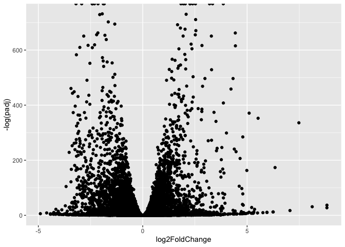
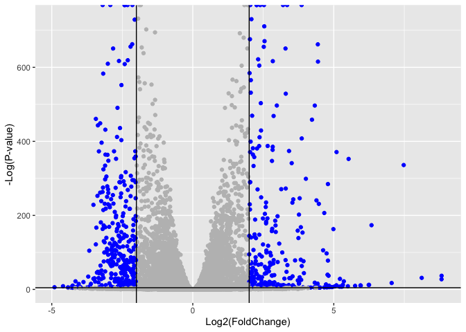

# Class 14: RNASeq mini-project
Aarav Prasad (PID: A17440940)

- [Background](#background)
- [Data Import](#data-import)
- [Sanity check](#sanity-check)
- [Setup DESeq object](#setup-deseq-object)
- [Run DESeq analysis pipeline](#run-deseq-analysis-pipeline)
- [Extract the results](#extract-the-results)
- [Data Vis](#data-vis)
- [Add annotation data](#add-annotation-data)
- [Pathway analysis](#pathway-analysis)
  - [Gene Ontology (GO)](#gene-ontology-go)
  - [Reactome Analysis](#reactome-analysis)
- [Save our results](#save-our-results)

## Background

In today’s mini project The data for our hands-on session comes from GEO
entry: GSE37704, which is associated with the following publication:

> Trapnell C, Hendrickson DG, Sauvageau M, Goff L et al. “Differential
> analysis of gene regulation at transcript resolution with RNA-seq”.
> Nat Biotechnol 2013 Jan;31(1):46-53. PMID: 23222703

The authors report on differential analysis of lung fibroblasts in
response to loss of the developmental transcription factor HOXA1.

## Data Import

Read counts and metadata CSV files

``` r
library(DESeq2)
```

    Loading required package: S4Vectors

    Loading required package: stats4

    Loading required package: BiocGenerics

    Loading required package: generics


    Attaching package: 'generics'

    The following objects are masked from 'package:base':

        as.difftime, as.factor, as.ordered, intersect, is.element, setdiff,
        setequal, union


    Attaching package: 'BiocGenerics'

    The following objects are masked from 'package:stats':

        IQR, mad, sd, var, xtabs

    The following objects are masked from 'package:base':

        anyDuplicated, aperm, append, as.data.frame, basename, cbind,
        colnames, dirname, do.call, duplicated, eval, evalq, Filter, Find,
        get, grep, grepl, is.unsorted, lapply, Map, mapply, match, mget,
        order, paste, pmax, pmax.int, pmin, pmin.int, Position, rank,
        rbind, Reduce, rownames, sapply, saveRDS, table, tapply, unique,
        unsplit, which.max, which.min


    Attaching package: 'S4Vectors'

    The following object is masked from 'package:utils':

        findMatches

    The following objects are masked from 'package:base':

        expand.grid, I, unname

    Loading required package: IRanges

    Loading required package: GenomicRanges

    Loading required package: Seqinfo

    Loading required package: SummarizedExperiment

    Loading required package: MatrixGenerics

    Loading required package: matrixStats


    Attaching package: 'MatrixGenerics'

    The following objects are masked from 'package:matrixStats':

        colAlls, colAnyNAs, colAnys, colAvgsPerRowSet, colCollapse,
        colCounts, colCummaxs, colCummins, colCumprods, colCumsums,
        colDiffs, colIQRDiffs, colIQRs, colLogSumExps, colMadDiffs,
        colMads, colMaxs, colMeans2, colMedians, colMins, colOrderStats,
        colProds, colQuantiles, colRanges, colRanks, colSdDiffs, colSds,
        colSums2, colTabulates, colVarDiffs, colVars, colWeightedMads,
        colWeightedMeans, colWeightedMedians, colWeightedSds,
        colWeightedVars, rowAlls, rowAnyNAs, rowAnys, rowAvgsPerColSet,
        rowCollapse, rowCounts, rowCummaxs, rowCummins, rowCumprods,
        rowCumsums, rowDiffs, rowIQRDiffs, rowIQRs, rowLogSumExps,
        rowMadDiffs, rowMads, rowMaxs, rowMeans2, rowMedians, rowMins,
        rowOrderStats, rowProds, rowQuantiles, rowRanges, rowRanks,
        rowSdDiffs, rowSds, rowSums2, rowTabulates, rowVarDiffs, rowVars,
        rowWeightedMads, rowWeightedMeans, rowWeightedMedians,
        rowWeightedSds, rowWeightedVars

    Loading required package: Biobase

    Welcome to Bioconductor

        Vignettes contain introductory material; view with
        'browseVignettes()'. To cite Bioconductor, see
        'citation("Biobase")', and for packages 'citation("pkgname")'.


    Attaching package: 'Biobase'

    The following object is masked from 'package:MatrixGenerics':

        rowMedians

    The following objects are masked from 'package:matrixStats':

        anyMissing, rowMedians

``` r
metaFile <- "GSE37704_metadata.csv"
countFile <- "GSE37704_featurecounts.csv"

# Import metadata and take a peek
colData = read.csv(metaFile, row.names=1)
head(colData)
```

                  condition
    SRR493366 control_sirna
    SRR493367 control_sirna
    SRR493368 control_sirna
    SRR493369      hoxa1_kd
    SRR493370      hoxa1_kd
    SRR493371      hoxa1_kd

## Sanity check

``` r
colData
```

                  condition
    SRR493366 control_sirna
    SRR493367 control_sirna
    SRR493368 control_sirna
    SRR493369      hoxa1_kd
    SRR493370      hoxa1_kd
    SRR493371      hoxa1_kd

``` r
# Import countdata
countData = read.csv(countFile, row.names=1)
head(countData)
```

                    length SRR493366 SRR493367 SRR493368 SRR493369 SRR493370
    ENSG00000186092    918         0         0         0         0         0
    ENSG00000279928    718         0         0         0         0         0
    ENSG00000279457   1982        23        28        29        29        28
    ENSG00000278566    939         0         0         0         0         0
    ENSG00000273547    939         0         0         0         0         0
    ENSG00000187634   3214       124       123       205       207       212
                    SRR493371
    ENSG00000186092         0
    ENSG00000279928         0
    ENSG00000279457        46
    ENSG00000278566         0
    ENSG00000273547         0
    ENSG00000187634       258

Hmm… remember that we need the `countData` and `colData` files to match
up so we will need to remove that odd first column in `countData` namely
`countData$length`.

> Q. Complete the code below to remove the troublesome first column from
> countData

``` r
countData <- as.matrix(countData[, -1])
head(countData)
```

                    SRR493366 SRR493367 SRR493368 SRR493369 SRR493370 SRR493371
    ENSG00000186092         0         0         0         0         0         0
    ENSG00000279928         0         0         0         0         0         0
    ENSG00000279457        23        28        29        29        28        46
    ENSG00000278566         0         0         0         0         0         0
    ENSG00000273547         0         0         0         0         0         0
    ENSG00000187634       124       123       205       207       212       258

> Q. Complete the code below to filter countData to exclude genes
> (i.e. rows) where we have 0 read count across all samples
> (i.e. columns).

Tip: What will rowSums() of countData return and how could you use it in
this context?

## Setup DESeq object

``` r
dim(countData)
```

    [1] 19808     6

``` r
dds = DESeqDataSetFromMatrix(countData= countData,
                             colData= colData,
                             design=~ condition)
```

    Warning in DESeqDataSet(se, design = design, ignoreRank): some variables in
    design formula are characters, converting to factors

``` r
dds = DESeq(dds)
```

    estimating size factors

    estimating dispersions

    gene-wise dispersion estimates

    mean-dispersion relationship

    final dispersion estimates

    fitting model and testing

``` r
dds
```

    class: DESeqDataSet 
    dim: 19808 6 
    metadata(1): version
    assays(4): counts mu H cooks
    rownames(19808): ENSG00000186092 ENSG00000279928 ... ENSG00000277475
      ENSG00000268674
    rowData names(22): baseMean baseVar ... deviance maxCooks
    colnames(6): SRR493366 SRR493367 ... SRR493370 SRR493371
    colData names(2): condition sizeFactor

## Run DESeq analysis pipeline

``` r
res = results(dds)
```

## Extract the results

Big table with log2 fold changes and p-values

> Q. Call the summary() function on your results to get a sense of how
> many genes are up or down-regulated at the default 0.1 p-value cutoff.

``` r
summary(res)
```


    out of 15975 with nonzero total read count
    adjusted p-value < 0.1
    LFC > 0 (up)       : 4349, 27%
    LFC < 0 (down)     : 4393, 27%
    outliers [1]       : 0, 0%
    low counts [2]     : 1221, 7.6%
    (mean count < 0)
    [1] see 'cooksCutoff' argument of ?results
    [2] see 'independentFiltering' argument of ?results

## Data Vis

Volcano plot

Now we will make a volcano plot, a commonly produced visualization from
this type of data that we introduced last day. Basically it’s a plot of
log2 fold change vs -log adjusted p-value.

``` r
library(ggplot2)

ggplot(res) +
  aes(log2FoldChange,
      -log(padj)) +
  geom_point()
```

    Warning: Removed 5054 rows containing missing values or values outside the scale range
    (`geom_point()`).



> Q. Improve this plot by completing the below code, which adds color,
> axis labels and cutoff lines:

``` r
mycols <- rep("gray", nrow(res))

mycols[ abs(res$log2FoldChange) > 2 ] <- "blue"

mycols[ res$padj > 0.01 ] <- "gray"

ggplot(res) +
  aes(log2FoldChange,
      -log(padj)) +
  geom_point(col = mycols) +
  xlab("Log2(FoldChange)") +
  ylab("-Log(P-value)") +
  geom_vline(xintercept = c(-2, 2)) +
  geom_hline(yintercept = -log(0.01))
```

    Warning: Removed 5054 rows containing missing values or values outside the scale range
    (`geom_point()`).



## Add annotation data

Since we mapped and counted against the Ensembl annotation, our results
only have information about Ensembl gene IDs. However, our pathway
analysis downstream will use KEGG pathways, and genes in KEGG pathways
are annotated with Entrez gene IDs. So lets add them as we did the last
day.

> Q. Use the mapIDs() function multiple times to add SYMBOL, ENTREZID
> and GENENAME annotation to our results by completing the code below.

``` r
library(AnnotationDbi)
library(org.Hs.eg.db)
```

``` r
columns(org.Hs.eg.db)
```

     [1] "ACCNUM"       "ALIAS"        "ENSEMBL"      "ENSEMBLPROT"  "ENSEMBLTRANS"
     [6] "ENTREZID"     "ENZYME"       "EVIDENCE"     "EVIDENCEALL"  "GENENAME"    
    [11] "GENETYPE"     "GO"           "GOALL"        "IPI"          "MAP"         
    [16] "OMIM"         "ONTOLOGY"     "ONTOLOGYALL"  "PATH"         "PFAM"        
    [21] "PMID"         "PROSITE"      "REFSEQ"       "SYMBOL"       "UCSCKG"      
    [26] "UNIPROT"     

``` r
res$symbol <- mapIds(org.Hs.eg.db,
                    keys=row.names(res), 
                    keytype="ENSEMBL",
                    column= "SYMBOL",
                    multiVals="first")
```

    'select()' returned 1:many mapping between keys and columns

``` r
res$entrez <- mapIds(org.Hs.eg.db,
                    keys=row.names(res),
                    keytype="ENSEMBL",
                    column="ENTREZID",
                    multiVals="first")
```

    'select()' returned 1:many mapping between keys and columns

``` r
res$name <- mapIds(org.Hs.eg.db,
                    keys=row.names(res),
                    keytype= "ENSEMBL",
                    column= "GENENAME",
                    multiVals="first")
```

    'select()' returned 1:many mapping between keys and columns

``` r
head(res, 10)
```

    log2 fold change (MLE): condition hoxa1 kd vs control sirna 
    Wald test p-value: condition hoxa1 kd vs control sirna 
    DataFrame with 10 rows and 9 columns
                     baseMean log2FoldChange     lfcSE       stat      pvalue
                    <numeric>      <numeric> <numeric>  <numeric>   <numeric>
    ENSG00000186092    0.0000             NA        NA         NA          NA
    ENSG00000279928    0.0000             NA        NA         NA          NA
    ENSG00000279457   29.9136      0.1792571 0.3248215   0.551863 5.81042e-01
    ENSG00000278566    0.0000             NA        NA         NA          NA
    ENSG00000273547    0.0000             NA        NA         NA          NA
    ENSG00000187634  183.2296      0.4264571 0.1402658   3.040350 2.36304e-03
    ENSG00000188976 1651.1881     -0.6927205 0.0548465 -12.630156 1.43993e-36
    ENSG00000187961  209.6379      0.7297556 0.1318599   5.534326 3.12428e-08
    ENSG00000187583   47.2551      0.0405765 0.2718928   0.149237 8.81366e-01
    ENSG00000187642   11.9798      0.5428105 0.5215598   1.040744 2.97994e-01
                           padj      symbol      entrez                   name
                      <numeric> <character> <character>            <character>
    ENSG00000186092          NA       OR4F5       79501 olfactory receptor f..
    ENSG00000279928          NA          NA          NA                     NA
    ENSG00000279457 6.87080e-01          NA          NA                     NA
    ENSG00000278566          NA          NA          NA                     NA
    ENSG00000273547          NA          NA          NA                     NA
    ENSG00000187634 5.16278e-03      SAMD11      148398 sterile alpha motif ..
    ENSG00000188976 1.76744e-35       NOC2L       26155 NOC2 like nucleolar ..
    ENSG00000187961 1.13536e-07      KLHL17      339451 kelch like family me..
    ENSG00000187583 9.18988e-01     PLEKHN1       84069 pleckstrin homology ..
    ENSG00000187642 4.03817e-01       PERM1       84808 PPARGC1 and ESRR ind..

> Q. Finally for this section let’s reorder these results by adjusted
> p-value and save them to a CSV file in your current project directory.

``` r
res = res[order(res$padj),]
write.csv(res, file="deseq_results.csv")
```

## Pathway analysis

KEGG, GO, and REACTOME

Here we are going to use the gage package for pathway analysis. Once we
have a list of enriched pathways, we’re going to use the pathview
package to draw pathway diagrams, shading the molecules in the pathway
by their degree of up/down-regulation.

``` r
library(pathview)
```

    ##############################################################################
    Pathview is an open source software package distributed under GNU General
    Public License version 3 (GPLv3). Details of GPLv3 is available at
    http://www.gnu.org/licenses/gpl-3.0.html. Particullary, users are required to
    formally cite the original Pathview paper (not just mention it) in publications
    or products. For details, do citation("pathview") within R.

    The pathview downloads and uses KEGG data. Non-academic uses may require a KEGG
    license agreement (details at http://www.kegg.jp/kegg/legal.html).
    ##############################################################################

``` r
library(gage)
```

``` r
library(gageData)

data(kegg.sets.hs)
data(sigmet.idx.hs)

# Focus on signaling and metabolic pathways only
kegg.sets.hs = kegg.sets.hs[sigmet.idx.hs]

# Examine the first 3 pathways
head(kegg.sets.hs, 3)
```

    $`hsa00232 Caffeine metabolism`
    [1] "10"   "1544" "1548" "1549" "1553" "7498" "9"   

    $`hsa00983 Drug metabolism - other enzymes`
     [1] "10"     "1066"   "10720"  "10941"  "151531" "1548"   "1549"   "1551"  
     [9] "1553"   "1576"   "1577"   "1806"   "1807"   "1890"   "221223" "2990"  
    [17] "3251"   "3614"   "3615"   "3704"   "51733"  "54490"  "54575"  "54576" 
    [25] "54577"  "54578"  "54579"  "54600"  "54657"  "54658"  "54659"  "54963" 
    [33] "574537" "64816"  "7083"   "7084"   "7172"   "7363"   "7364"   "7365"  
    [41] "7366"   "7367"   "7371"   "7372"   "7378"   "7498"   "79799"  "83549" 
    [49] "8824"   "8833"   "9"      "978"   

    $`hsa00230 Purine metabolism`
      [1] "100"    "10201"  "10606"  "10621"  "10622"  "10623"  "107"    "10714" 
      [9] "108"    "10846"  "109"    "111"    "11128"  "11164"  "112"    "113"   
     [17] "114"    "115"    "122481" "122622" "124583" "132"    "158"    "159"   
     [25] "1633"   "171568" "1716"   "196883" "203"    "204"    "205"    "221823"
     [33] "2272"   "22978"  "23649"  "246721" "25885"  "2618"   "26289"  "270"   
     [41] "271"    "27115"  "272"    "2766"   "2977"   "2982"   "2983"   "2984"  
     [49] "2986"   "2987"   "29922"  "3000"   "30833"  "30834"  "318"    "3251"  
     [57] "353"    "3614"   "3615"   "3704"   "377841" "471"    "4830"   "4831"  
     [65] "4832"   "4833"   "4860"   "4881"   "4882"   "4907"   "50484"  "50940" 
     [73] "51082"  "51251"  "51292"  "5136"   "5137"   "5138"   "5139"   "5140"  
     [81] "5141"   "5142"   "5143"   "5144"   "5145"   "5146"   "5147"   "5148"  
     [89] "5149"   "5150"   "5151"   "5152"   "5153"   "5158"   "5167"   "5169"  
     [97] "51728"  "5198"   "5236"   "5313"   "5315"   "53343"  "54107"  "5422"  
    [105] "5424"   "5425"   "5426"   "5427"   "5430"   "5431"   "5432"   "5433"  
    [113] "5434"   "5435"   "5436"   "5437"   "5438"   "5439"   "5440"   "5441"  
    [121] "5471"   "548644" "55276"  "5557"   "5558"   "55703"  "55811"  "55821" 
    [129] "5631"   "5634"   "56655"  "56953"  "56985"  "57804"  "58497"  "6240"  
    [137] "6241"   "64425"  "646625" "654364" "661"    "7498"   "8382"   "84172" 
    [145] "84265"  "84284"  "84618"  "8622"   "8654"   "87178"  "8833"   "9060"  
    [153] "9061"   "93034"  "953"    "9533"   "954"    "955"    "956"    "957"   
    [161] "9583"   "9615"  

The main gage() function requires a named vector of fold changes, where
the names of the values are the Entrez gene IDs.

Note that we used the mapIDs() function above to obtain Entrez gene IDs
(stored in
res$entrez) and we have the fold change results from DESeq2 analysis (stored in res$log2FoldChange).

``` r
foldchanges = res$log2FoldChange
names(foldchanges) = res$entrez
head(foldchanges)
```

         1266     54855      1465      2034      2150      6659 
    -2.422719  3.201955 -2.313738 -1.888019  3.344508  2.392288 

Now, let’s run the **gage** pathway analysis.

``` r
keggres = gage(foldchanges, gsets=kegg.sets.hs)
attributes(keggres)
```

    $names
    [1] "greater" "less"    "stats"  

``` r
head(keggres$less)
```

                                             p.geomean stat.mean        p.val
    hsa04110 Cell cycle                   7.077982e-06 -4.432593 7.077982e-06
    hsa03030 DNA replication              9.424076e-05 -3.951803 9.424076e-05
    hsa03013 RNA transport                1.160132e-03 -3.080629 1.160132e-03
    hsa04114 Oocyte meiosis               2.563806e-03 -2.827297 2.563806e-03
    hsa03440 Homologous recombination     3.066756e-03 -2.852899 3.066756e-03
    hsa00010 Glycolysis / Gluconeogenesis 4.360092e-03 -2.663825 4.360092e-03
                                                q.val set.size         exp1
    hsa04110 Cell cycle                   0.001160789      124 7.077982e-06
    hsa03030 DNA replication              0.007727742       36 9.424076e-05
    hsa03013 RNA transport                0.063420544      149 1.160132e-03
    hsa04114 Oocyte meiosis               0.100589607      112 2.563806e-03
    hsa03440 Homologous recombination     0.100589607       28 3.066756e-03
    hsa00010 Glycolysis / Gluconeogenesis 0.119175854       65 4.360092e-03

Now, let’s try out the `pathview()` function from the **pathview
package** to make a pathway plot with our RNA-Seq expression results
shown in color. To begin with lets manually supply a `pathway.id`
(namely the first part of the “hsa04110 Cell cycle”) that we could see
from the print out above.

``` r
pathview(gene.data=foldchanges, pathway.id="hsa04110")
```

    'select()' returned 1:1 mapping between keys and columns

    Info: Working in directory /Users/aaravprasad/Desktop/BIMM143/bimm143_github/class14

    Info: Writing image file hsa04110.pathview.png

 Now, let’s process our results a bit more to
automagicaly pull out the top 5 upregulated pathways, then further
process that just to get the pathway IDs needed by the `pathview()`
function. We’ll use these KEGG pathway IDs for pathview plotting below.

``` r
## Focus on top 5 upregulated pathways here for demo purposes only
keggrespathways <- rownames(keggres$greater)[1:5]

# Extract the 8 character long IDs part of each string
keggresids = substr(keggrespathways, start=1, stop=8)
keggresids
```

    [1] "hsa04740" "hsa04640" "hsa00140" "hsa04630" "hsa04976"

``` r
pathview(gene.data=foldchanges, pathway.id=keggresids, species="hsa")
```

    'select()' returned 1:1 mapping between keys and columns

    Info: Working in directory /Users/aaravprasad/Desktop/BIMM143/bimm143_github/class14

    Info: Writing image file hsa04740.pathview.png

    'select()' returned 1:1 mapping between keys and columns

    Info: Working in directory /Users/aaravprasad/Desktop/BIMM143/bimm143_github/class14

    Info: Writing image file hsa04640.pathview.png

    'select()' returned 1:1 mapping between keys and columns

    Info: Working in directory /Users/aaravprasad/Desktop/BIMM143/bimm143_github/class14

    Info: Writing image file hsa00140.pathview.png

    'select()' returned 1:1 mapping between keys and columns

    Info: Working in directory /Users/aaravprasad/Desktop/BIMM143/bimm143_github/class14

    Info: Writing image file hsa04630.pathview.png

    'select()' returned 1:1 mapping between keys and columns

    Info: Working in directory /Users/aaravprasad/Desktop/BIMM143/bimm143_github/class14

    Info: Writing image file hsa04976.pathview.png


 
  \>Q. Can you do
the same procedure as above to plot the pathview figures for the top 5
down-regulated pathways?

``` r
keggrespathways <- rownames(keggres$less)[1:5]

keggresids <- substr(keggrespathways, start = 1, stop = 8)
keggresids
```

    [1] "hsa04110" "hsa03030" "hsa03013" "hsa04114" "hsa03440"

``` r
pathview(gene.data = foldchanges, pathway.id = keggresids, species = "hsa")
```

    'select()' returned 1:1 mapping between keys and columns

    Info: Working in directory /Users/aaravprasad/Desktop/BIMM143/bimm143_github/class14

    Info: Writing image file hsa04110.pathview.png

    'select()' returned 1:1 mapping between keys and columns

    Info: Working in directory /Users/aaravprasad/Desktop/BIMM143/bimm143_github/class14

    Info: Writing image file hsa03030.pathview.png

    'select()' returned 1:1 mapping between keys and columns

    Info: Working in directory /Users/aaravprasad/Desktop/BIMM143/bimm143_github/class14

    Info: Writing image file hsa03013.pathview.png

    'select()' returned 1:1 mapping between keys and columns

    Info: Working in directory /Users/aaravprasad/Desktop/BIMM143/bimm143_github/class14

    Info: Writing image file hsa04114.pathview.png

    'select()' returned 1:1 mapping between keys and columns

    Info: Working in directory /Users/aaravprasad/Desktop/BIMM143/bimm143_github/class14

    Info: Writing image file hsa03440.pathview.png

### Gene Ontology (GO)

We can also do a similar procedure with gene ontology. Similar to above,
go.sets.hs has all GO terms. go.subs.hs is a named list containing
indexes for the BP, CC, and MF ontologies. Let’s focus on BP (a.k.a
Biological Process) here.

``` r
data(go.sets.hs)
data(go.subs.hs)

# Focus on Biological Process subset of GO
gobpsets = go.sets.hs[go.subs.hs$BP]

gobpres = gage(foldchanges, gsets=gobpsets)

lapply(gobpres, head)
```

    $greater
                                                  p.geomean stat.mean        p.val
    GO:0007156 homophilic cell adhesion        1.734864e-05  4.210777 1.734864e-05
    GO:0048729 tissue morphogenesis            5.407952e-05  3.888470 5.407952e-05
    GO:0002009 morphogenesis of an epithelium  5.727599e-05  3.878706 5.727599e-05
    GO:0030855 epithelial cell differentiation 2.053700e-04  3.554776 2.053700e-04
    GO:0060562 epithelial tube morphogenesis   2.927804e-04  3.458463 2.927804e-04
    GO:0048598 embryonic morphogenesis         2.959270e-04  3.446527 2.959270e-04
                                                    q.val set.size         exp1
    GO:0007156 homophilic cell adhesion        0.07584825      137 1.734864e-05
    GO:0048729 tissue morphogenesis            0.08347021      483 5.407952e-05
    GO:0002009 morphogenesis of an epithelium  0.08347021      382 5.727599e-05
    GO:0030855 epithelial cell differentiation 0.16449701      299 2.053700e-04
    GO:0060562 epithelial tube morphogenesis   0.16449701      289 2.927804e-04
    GO:0048598 embryonic morphogenesis         0.16449701      498 2.959270e-04

    $less
                                                p.geomean stat.mean        p.val
    GO:0048285 organelle fission             6.626774e-16 -8.170439 6.626774e-16
    GO:0000280 nuclear division              1.797050e-15 -8.051200 1.797050e-15
    GO:0007067 mitosis                       1.797050e-15 -8.051200 1.797050e-15
    GO:0000087 M phase of mitotic cell cycle 4.757263e-15 -7.915080 4.757263e-15
    GO:0007059 chromosome segregation        1.081862e-11 -6.974546 1.081862e-11
    GO:0051301 cell division                 8.718528e-11 -6.455491 8.718528e-11
                                                    q.val set.size         exp1
    GO:0048285 organelle fission             2.618901e-12      386 6.626774e-16
    GO:0000280 nuclear division              2.618901e-12      362 1.797050e-15
    GO:0007067 mitosis                       2.618901e-12      362 1.797050e-15
    GO:0000087 M phase of mitotic cell cycle 5.199689e-12      373 4.757263e-15
    GO:0007059 chromosome segregation        9.459800e-09      146 1.081862e-11
    GO:0051301 cell division                 6.352901e-08      479 8.718528e-11

    $stats
                                               stat.mean     exp1
    GO:0007156 homophilic cell adhesion         4.210777 4.210777
    GO:0048729 tissue morphogenesis             3.888470 3.888470
    GO:0002009 morphogenesis of an epithelium   3.878706 3.878706
    GO:0030855 epithelial cell differentiation  3.554776 3.554776
    GO:0060562 epithelial tube morphogenesis    3.458463 3.458463
    GO:0048598 embryonic morphogenesis          3.446527 3.446527

### Reactome Analysis

Reactome is database consisting of biological molecules and their
relation to pathways and processes.

Let’s now conduct over-representation enrichment analysis and
pathway-topology analysis with Reactome using the previous list of
significant genes generated from our differential expression results
above.

First, using R, output the list of significant genes at the 0.05 level
as a plain text file:

``` r
sig_genes <- res[res$padj <= 0.05 & !is.na(res$padj), "symbol"]
print(paste("Total number of significant genes:", length(sig_genes)))
```

    [1] "Total number of significant genes: 8146"

``` r
write.table(sig_genes, file="significant_genes.txt", row.names=FALSE, col.names=FALSE, quote=FALSE)
```

> Q: What pathway has the most significant “Entities p-value”? Do the
> most significant pathways listed match your previous KEGG results?
> What factors could cause differences between the two methods?

Cell Cycle / Cell Cycle, Mitotic has the most significant Entities
p-value. This matches the KEGG results, where Cell cycle was the top
down-regulated pathway. Differences can come from Reactome vs. KEGG
using different pathway definitions, gene IDs, pathway sizes, and
statistical methods.

## Save our results
