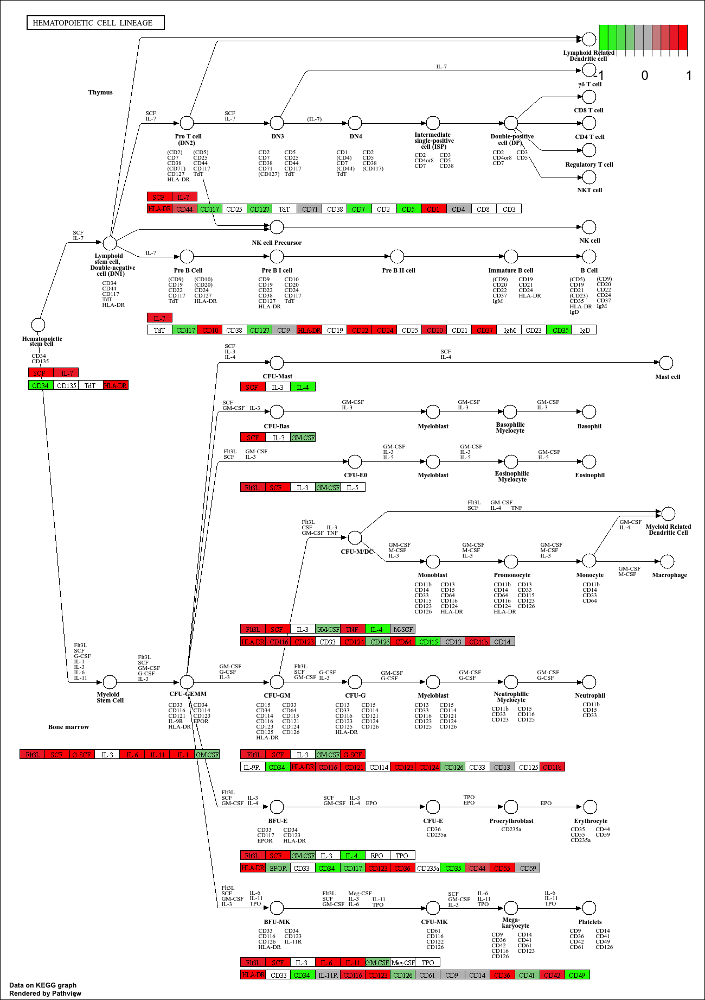
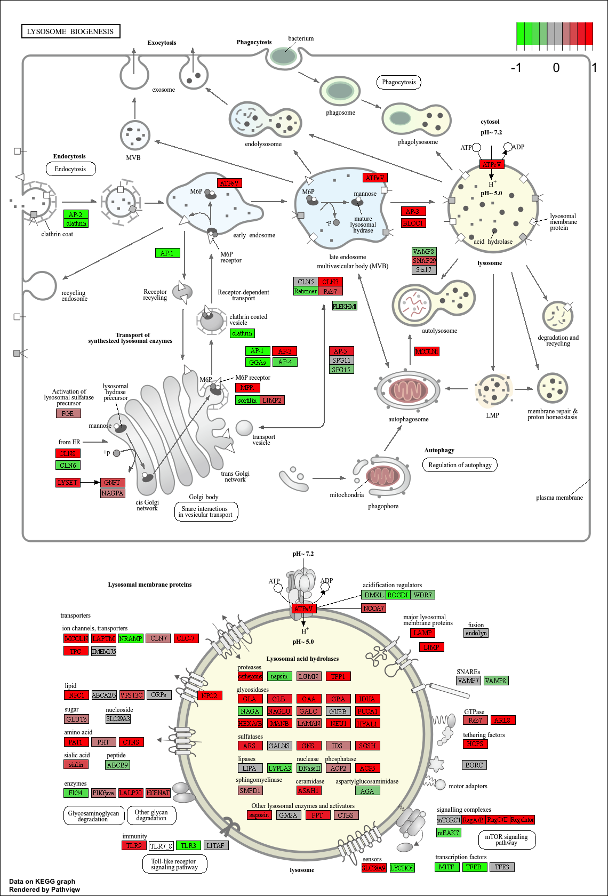
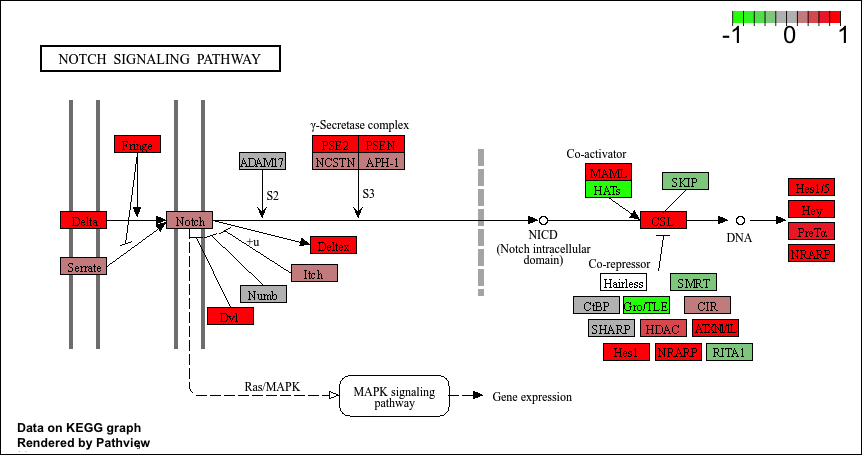

## Background

In today's mini project The data for our hands-on session comes from GEO entry: GSE37704, which is associated with the following publication:

>Trapnell C, Hendrickson DG, Sauvageau M, Goff L et al. "Differential analysis of gene regulation at transcript resolution with RNA-seq". Nat Biotechnol 2013 Jan;31(1):46-53. PMID: 23222703

The authors report on differential analysis of lung fibroblasts in response to loss of the developmental transcription factor HOXA1.

## Data Import
Read counts and metadata CSV files

```{r}
library(DESeq2)
```

```{r}
metaFile <- "GSE37704_metadata.csv"
countFile <- "GSE37704_featurecounts.csv"

# Import metadata and take a peek
colData = read.csv(metaFile, row.names=1)
head(colData)
```

## Sanity check

```{r}
colData
```

```{r}
# Import countdata
countData = read.csv(countFile, row.names=1)
head(countData)
```

Hmm... remember that we need the `countData` and `colData` files to match up so we will need to remove that odd first column in `countData` namely `countData$length`.

>Q. Complete the code below to remove the troublesome first column from countData

```{r}
countData <- as.matrix(countData[, -1])
head(countData)
```


>Q. Complete the code below to filter countData to exclude genes (i.e. rows) where we have 0 read count across all samples (i.e. columns).

Tip: What will rowSums() of countData return and how could you use it in this context?


## Setup DESeq object

```{r}
dim(countData)
```

```{r}

dds = DESeqDataSetFromMatrix(countData= countData,
                             colData= colData,
                             design=~ condition)
dds = DESeq(dds)
dds

```


## Run DESeq analysis pipeline

```{r}
res = results(dds)
```


## Extract the results

Big table with log2 fold changes and p-values

>Q. Call the summary() function on your results to get a sense of how many genes are up or down-regulated at the default 0.1 p-value cutoff.

```{r}
summary(res)
```

## Data Vis
Volcano plot

Now we will make a volcano plot, a commonly produced visualization from this type of data that we introduced last day. Basically it's a plot of log2 fold change vs -log adjusted p-value.

```{r}
library(ggplot2)

ggplot(res) +
  aes(log2FoldChange,
      -log(padj)) +
  geom_point()
```
>Q. Improve this plot by completing the below code, which adds color, axis labels and cutoff lines:

```{r}
mycols <- rep("gray", nrow(res))

mycols[ abs(res$log2FoldChange) > 2 ] <- "blue"

mycols[ res$padj > 0.01 ] <- "gray"

ggplot(res) +
  aes(log2FoldChange,
      -log(padj)) +
  geom_point(col = mycols) +
  xlab("Log2(FoldChange)") +
  ylab("-Log(P-value)") +
  geom_vline(xintercept = c(-2, 2)) +
  geom_hline(yintercept = -log(0.01))
```

## Add annotation data

Since we mapped and counted against the Ensembl annotation, our results only have information about Ensembl gene IDs. However, our pathway analysis downstream will use KEGG pathways, and genes in KEGG pathways are annotated with Entrez gene IDs. So lets add them as we did the last day.

>Q. Use the mapIDs() function multiple times to add SYMBOL, ENTREZID and GENENAME annotation to our results by completing the code below.

```{r}
library(AnnotationDbi)
library(org.Hs.eg.db)

columns(org.Hs.eg.db)

res$symbol <- mapIds(org.Hs.eg.db,
                    keys=row.names(res), 
                    keytype="ENSEMBL",
                    column= "SYMBOL",
                    multiVals="first")

res$entrez <- mapIds(org.Hs.eg.db,
                    keys=row.names(res),
                    keytype="ENSEMBL",
                    column="ENTREZID",
                    multiVals="first")

res$name <- mapIds(org.Hs.eg.db,
                    keys=row.names(res),
                    keytype= "ENSEMBL",
                    column= "GENENAME",
                    multiVals="first")

head(res, 10)
```

>Q. Finally for this section let's reorder these results by adjusted p-value and save them to a CSV file in your current project directory.

```{r}
res = res[order(res$padj),]
write.csv(res, file="deseq_results.csv")
```


## Pathway analysis
KEGG, GO, and REACTOME

Here we are going to use the gage package for pathway analysis. Once we have a list of enriched pathways, we're going to use the pathview package to draw pathway diagrams, shading the molecules in the pathway by their degree of up/down-regulation.

```{r}
library(pathview)
library(gage)
library(gageData)

data(kegg.sets.hs)
data(sigmet.idx.hs)

# Focus on signaling and metabolic pathways only
kegg.sets.hs = kegg.sets.hs[sigmet.idx.hs]

# Examine the first 3 pathways
head(kegg.sets.hs, 3)
```


The main gage() function requires a named vector of fold changes, where the names of the values are the Entrez gene IDs.

Note that we used the mapIDs() function above to obtain Entrez gene IDs (stored in res$entrez) and we have the fold change results from DESeq2 analysis (stored in res$log2FoldChange).

```{r}
foldchanges = res$log2FoldChange
names(foldchanges) = res$entrez
head(foldchanges)
```

Now, let’s run the **gage** pathway analysis.

```{r}
keggres = gage(foldchanges, gsets=kegg.sets.hs)
attributes(keggres)
```

```{r}
head(keggres$less)
```
Now, let's try out the `pathview()` function from the **pathview package** to make a pathway plot with our RNA-Seq expression results shown in color.
To begin with lets manually supply a `pathway.id` (namely the first part of the "hsa04110 Cell cycle") that we could see from the print out above.

```{r}
pathview(gene.data=foldchanges, pathway.id="hsa04110")
```


Now, let's process our results a bit more to automagicaly pull out the top 5 upregulated pathways, then further process that just to get the pathway IDs needed by the `pathview()` function. We'll use these KEGG pathway IDs for pathview plotting below.

```{r}
## Focus on top 5 upregulated pathways here for demo purposes only
keggrespathways <- rownames(keggres$greater)[1:5]

# Extract the 8 character long IDs part of each string
keggresids = substr(keggrespathways, start=1, stop=8)
keggresids

```

```{r}
pathview(gene.data=foldchanges, pathway.id=keggresids, species="hsa")
```

 


 

 
 
>Q. Can you do the same procedure as above to plot the pathview figures for the top 5 down-regulated pathways?

```{r}
keggrespathways <- rownames(keggres$less)[1:5]

keggresids <- substr(keggrespathways, start = 1, stop = 8)
keggresids

pathview(gene.data = foldchanges, pathway.id = keggresids, species = "hsa")
```


### Gene Ontology (GO)

We can also do a similar procedure with gene ontology. Similar to above, go.sets.hs has all GO terms. go.subs.hs is a named list containing indexes for the BP, CC, and MF ontologies. Let’s focus on BP (a.k.a Biological Process) here.

```{r}
data(go.sets.hs)
data(go.subs.hs)

# Focus on Biological Process subset of GO
gobpsets = go.sets.hs[go.subs.hs$BP]

gobpres = gage(foldchanges, gsets=gobpsets)

lapply(gobpres, head)

```

### Reactome Analysis

Reactome is database consisting of biological molecules and their relation to pathways and processes.

Let's now conduct over-representation enrichment analysis and pathway-topology analysis with Reactome using the previous list of significant genes generated from our differential expression results above.

First, using R, output the list of significant genes at the 0.05 level as a plain text file:

```{r}
sig_genes <- res[res$padj <= 0.05 & !is.na(res$padj), "symbol"]
print(paste("Total number of significant genes:", length(sig_genes)))
```

```{r}
write.table(sig_genes, file="significant_genes.txt", row.names=FALSE, col.names=FALSE, quote=FALSE)
```

>Q: What pathway has the most significant “Entities p-value”? Do the most significant pathways listed match your previous KEGG results? What factors could cause differences between the two methods?

Cell Cycle / Cell Cycle, Mitotic has the most significant Entities p-value. This matches the KEGG results, where Cell cycle was the top down-regulated pathway. Differences can come from Reactome vs. KEGG using different pathway definitions, gene IDs, pathway sizes, and statistical methods.


## Save our results

